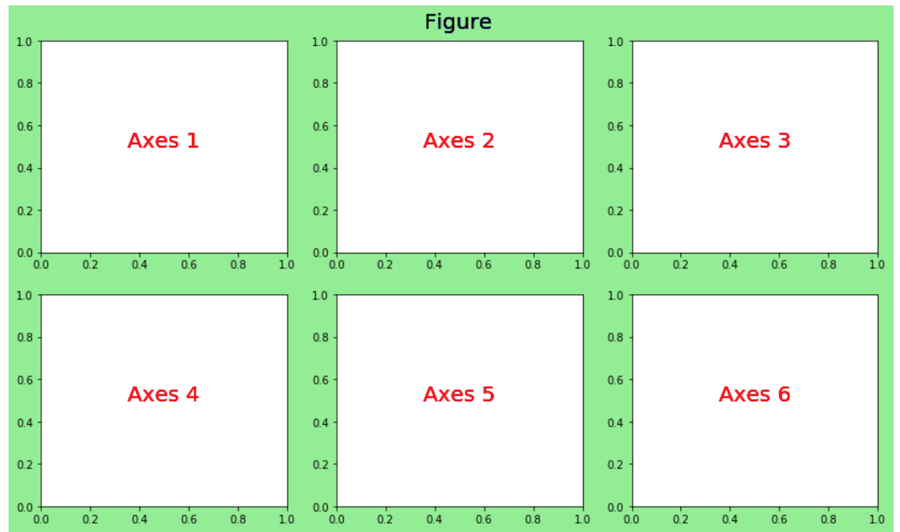

# Advanced Data Visualization {#sec-advanced-data-viz}

::: {.callout-note}
## Scenario: From Exploration to Communication

You've been analyzing shopper data and have a clear finding: spending patterns differ sharply by household income and day of the week. Your manager asks for something she can put in a slide deck for the executive team. The quick Pandas plots you used to explore the data aren't quite right — they're functional but rough. You need something polished, and you want to let the audience interact with the data themselves.

This is exactly where the broader Python visualization ecosystem comes in.
:::

In the previous chapter, you learned how to create quick, useful visualizations directly from Pandas DataFrames. Those exploratory plots are powerful for understanding data — but they are intentionally minimal. When the goal shifts from exploration to *communication*, or when you need to reveal statistical patterns, layer in interactivity, or produce a chart suitable for a presentation or publication, you need more.

Python's visualization ecosystem is rich. The [PyViz](https://pyviz.org/) project maintains a helpful landscape overview of the many available tools. Three libraries stand out for the most common needs you will encounter as an analyst:

- **Seaborn** — statistical visualization with beautiful defaults and minimal code
- **Matplotlib** — full control over every element of a figure; the foundation everything else builds on
- **Bokeh** — interactive, web-ready charts that let your audience explore the data themselves

This chapter introduces you to three libraries that each offer distinct advantages — and that is the point. As your data science work evolves, so does the way you need to communicate findings. A quick exploratory chart for your own analysis calls for something different than an annotated figure in a stakeholder report, which calls for something different again than an interactive dashboard that lets an executive drill into the numbers themselves. There is no single best visualization library, and part of becoming an effective data scientist is knowing how to evaluate your options and reach for the right tool for the moment.

Equally important is the skill of *learning new libraries*. The Python ecosystem moves quickly, and the tools you use today may not be the ones you reach for in five years. This chapter is as much about building the habit of exploring new libraries — reading documentation, working through examples, and adapting code to your own data — as it is about any specific plotting syntax. Those habits will serve you long after the details of any one API fade.

::: {.callout-tip}
## Challenge: Explore a Library on Your Own

The three libraries in this chapter are a starting point, not a complete picture. Visit [PyViz](https://pyviz.org/) and browse the landscape of Python visualization tools. Find one library that looks interesting to you — something not covered in this chapter — and try it out.

Pick a question about the Complete Journey data, find an example in that library's gallery or documentation, and adapt it to your data. You do not need to fully master the library. The goal is to practice the process: read the docs, run an example, break something, fix it, and produce something that answers your question.

Come to class ready to share: what library did you explore, what did you make, and what surprised you about it?
:::

By the end of this chapter, you will be able to:

* Explain when to reach for Seaborn, Matplotlib, or Bokeh instead of Pandas `.plot()`
* Create and customize common visualizations with each library using real retail data
* Navigate each library's documentation and gallery to self-direct further learning

::: {.callout-note}
## 📓 Follow Along in Colab!

As you read through this chapter, we encourage you to follow along using the [companion notebook](https://github.com/bradleyboehmke/uc-bana-4080/blob/main/notebooks/examples/14_advanced_data_viz.ipynb) in Google Colab (or other editor of choice).

👉 Open the [Advanced Data Viz Notebook in Colab](https://colab.research.google.com/github/bradleyboehmke/uc-bana-4080/blob/main/notebooks/examples/14_advanced_data_viz.ipynb).
:::

## Prerequisites

We will use the merged Complete Journey dataset throughout this chapter. Run this setup block once and all subsequent sections will have access to `df`.

```{python}
import pandas as pd
import matplotlib.pyplot as plt
import seaborn as sns
from completejourney_py import get_data

cj_data = get_data()
transactions = cj_data['transactions']
products     = cj_data['products']
demographics = cj_data['demographics']

df = (
    transactions
    .merge(products, on='product_id', how='left')
    .merge(demographics, on='household_id', how='left')
)

df.head()
```

---

## Seaborn

### Why Seaborn?

[Seaborn](https://seaborn.pydata.org/) is a statistical visualization library built directly on top of Matplotlib. It is designed to make exploring relationships in data faster and more visually appealing — without requiring you to manually configure every aspect of a plot.

Its main advantages over Pandas `.plot()`:

- **Statistical orientation.** Functions like `boxplot`, `violinplot`, and `histplot` are built specifically for distributional and relational analysis, with sensible statistical defaults.
- **Works natively with DataFrames.** Pass a DataFrame and column names — no need to extract Series manually.
- **Built-in group handling.** The `hue`, `col`, and `row` parameters let you add extra dimensions (color, facets) with a single argument.
- **Beautiful defaults.** Seaborn's default color palettes and styles are production-quality without any extra styling code.

Think of Seaborn as the natural next step after Pandas plotting. You already know how to produce quick charts with `.plot()` — Seaborn gives you more chart types, more analytical depth, and better-looking output, while still requiring far less code than writing the equivalent chart in raw Matplotlib. When you want a bit more flexibility than Pandas can offer but do not want to wrestle with Matplotlib's full API, Seaborn is the right middle ground.

Seaborn is the go-to choice when you want to quickly understand **how variables relate to each other** — especially when a third categorical or continuous dimension is involved.

```{python}
import seaborn as sns
```

### Example 1: Visualizing Distributions

A natural first step in any analysis is understanding how a variable is distributed. Seaborn's `histplot` produces a publication-quality histogram with an optional kernel density estimate (KDE) overlay — and does it in one line.

Here we look at the distribution of basket-level spending. We first aggregate transactions to one row per shopping trip, then plot the result.

```{python}
basket_spend = (
    transactions
    .groupby('basket_id', as_index=False)['sales_value']
    .sum()
)

fig, ax = plt.subplots(figsize=(8, 4))
sns.histplot(
    basket_spend['sales_value'],
    bins=60,
    kde=True,
    ax=ax
)
ax.set_xlabel('Basket Spend ($)')
ax.set_title('Distribution of Basket-Level Spending')
plt.tight_layout()
```

Notice how the distribution is strongly right-skewed — most trips are low-dollar, but a long tail of high-spend baskets exists. The KDE overlay makes the shape easier to read than bars alone.

::: {.callout-tip}
Compare this to creating the same plot with Pandas `plot.hist()`. Seaborn adds the KDE, better default styling, and axis labels — all with similar or less code.
:::

### Example 2: Comparing Groups

Seaborn excels at comparing a numeric variable across categories. The `boxplot` function accepts a DataFrame directly and handles the grouping for you.

Here we compare total household spending across income ranges, which immediately surfaces whether higher-income households spend more overall.

```{python}
household_spend = (
    df
    .groupby(['household_id', 'income'], as_index=False)['sales_value']
    .sum()
    .dropna(subset=['income'])
)

income_order = [
    'Under 15K', '15-24K', '25-34K', '35-49K',
    '50-74K', '75-99K', '100-124K', '125-149K',
    '150-174K', '175-199K', '200-249K', '250K+'
]

fig, ax = plt.subplots(figsize=(11, 5))
sns.boxplot(
    data=household_spend,
    x='income',
    y='sales_value',
    order=income_order,
    ax=ax
)
ax.set_xlabel('Income Range')
ax.set_ylabel('Total Household Spend ($)')
ax.set_title('Annual Household Spending by Income Range')
plt.xticks(rotation=45, ha='right')
plt.tight_layout()
```

The `order` parameter controls how income brackets appear on the x-axis. Producing this grouped comparison with raw Matplotlib would require significantly more code.

### Example 3: Exploring Relationships

Seaborn's `scatterplot` function adds a `hue` parameter that maps a third variable to color — making it easy to see whether a pattern differs across groups.

Here we look at store-level totals: total quantity sold vs. total sales value, colored by whether the store is above or below the median in number of shopping trips.

```{python}
store_summary = (
    df
    .groupby('store_id', as_index=False)
    .agg(
        sales_value=('sales_value', 'sum'),
        quantity=('quantity', 'sum'),
        n_trips=('basket_id', 'nunique')
    )
)
store_summary['traffic'] = (
    store_summary['n_trips']
    .gt(store_summary['n_trips'].median())
    .map({True: 'Above Median', False: 'Below Median'})
)

fig, ax = plt.subplots(figsize=(8, 5))
sns.scatterplot(
    data=store_summary,
    x='quantity',
    y='sales_value',
    hue='traffic',
    palette={'Above Median': '#e63946', 'Below Median': '#457b9d'},
    s=80,
    ax=ax
)
ax.set_xscale('log')
ax.set_yscale('log')
ax.set_xlabel('Total Quantity Sold (log scale)')
ax.set_ylabel('Total Sales (log scale)')
ax.set_title('Store-Level Sales vs. Quantity (by Traffic Tier)')
plt.tight_layout()
```

The log scales spread the points across the full plotting area, making the two tiers much easier to distinguish. The `hue` separation confirms that high-traffic stores cluster toward the upper right — more items sold and higher revenue — while the log transformation reveals that this pattern holds consistently across the full range of store sizes.

### Example 4: Heatmap

Heatmaps are ideal for revealing patterns across two categorical dimensions simultaneously. `sns.heatmap` takes a pivot table — rows are one category, columns are another, and cell values are encoded as color intensity — and produces a rich, immediately readable visualization that would take considerable Matplotlib code to replicate manually.

Here we build a day-of-week × hour-of-day grid showing when shoppers are most active. Each cell's color represents the number of unique shopping trips during that day-hour combination.

```{python}
day_order = ['Monday', 'Tuesday', 'Wednesday', 'Thursday', 'Friday', 'Saturday', 'Sunday']

heatmap_data = (
    transactions
    .assign(
        day_of_week=transactions['transaction_timestamp'].dt.day_name(),
        hour_of_day=transactions['transaction_timestamp'].dt.hour
    )
    .groupby(['day_of_week', 'hour_of_day'])['basket_id']
    .nunique()
    .unstack(fill_value=0)
    .reindex(day_order)
)

fig, ax = plt.subplots(figsize=(14, 5))
sns.heatmap(
    heatmap_data,
    cmap='YlOrRd',
    ax=ax,
    cbar_kws={'label': 'Number of Trips'}
)
ax.set_xlabel('Hour of Day')
ax.set_ylabel('')
ax.set_title('Shopping Traffic: Day × Hour of Day', fontsize=14, fontweight='bold')
ax.set_yticklabels(ax.get_yticklabels(), rotation=0)
plt.tight_layout()
```

The pattern emerges clearly: morning hours are consistently quiet across every day of the week, and shopping traffic builds toward a peak in the evening hours regardless of the day. What really stands out, though, is the weekend afternoon effect — Saturday and Sunday see considerably heavier traffic during the afternoon hours than any weekday, a pattern that would be easy to miss in a table of numbers but is unmistakable here. This is exactly the kind of story a well-chosen visualization tells — not just summarizing data, but revealing the shape of behavior in a way that drives real decisions. More advanced plots like this heatmap are worth the extra setup precisely because the insight they communicate is so much richer.

### Video: Seaborn Introduction

::: {.callout-note collapse="true"}
## 📺 Video Tutorial



Looking for more? Here are additional Seaborn tutorials worth watching:

- [Seaborn Tutorial for Beginners](https://youtu.be/ooqXQ37XHMM?si=8dtfnhw6XTv0ye_W)
- [Seaborn Full Course](https://youtu.be/6GUZXDef2U0?si=mUM7j34YDudKwsOo)
- [Seaborn Data Visualization](https://youtu.be/vaf4ir8eT38?si=Apz-wtKbH_uZB6T5)
:::

### Where to Go from Here

::: {.callout-note}
The [Seaborn gallery](https://seaborn.pydata.org/examples/) is the best starting point — every example includes runnable code. The [Seaborn API reference](https://seaborn.pydata.org/api.html) documents all available plot types and parameters. For a guided tour of statistical visualization concepts, the [Seaborn tutorial series](https://seaborn.pydata.org/tutorial.html) is excellent.
:::

### Your Turn

::: {.callout}
## Try This!

Using the Complete Journey data, try the following challenges with Seaborn:

1. Create a `sns.histplot` (with KDE) showing the distribution of **item quantities per basket** (total `quantity` per `basket_id`). How does this distribution compare in shape to basket-level spending?

2. Use `sns.boxplot` to compare basket-level spending across **income brackets** (`income`). Does spending tend to increase with income?

3. Use `sns.scatterplot` with the `hue` parameter to plot total `sales_value` vs. total `quantity` at the **household level**, coloring points by `marital_status`. Do you notice any separation between groups?

**Bonus:** Try replacing `sns.boxplot` in challenge 2 with `sns.violinplot`. What additional information does the violin shape communicate compared to the box?
:::

---

## Matplotlib

### Why Matplotlib?

[Matplotlib](https://matplotlib.org/) is the foundational plotting library in the Python ecosystem. Pandas `.plot()` is a wrapper around it. Seaborn is built on top of it. Nearly every other Python visualization library either uses Matplotlib under the hood or borrows its design patterns.

**When is Matplotlib the right choice?** Reach for it when you need complete control over how a figure looks and behaves. Seaborn and Pandas get you most of the way there with far less code, but they make decisions on your behalf — default colors, tick spacing, font sizes, legend placement. When those defaults are not good enough, Matplotlib lets you override every one of them. This matters most in professional contexts where presentation quality is non-negotiable:

- An **academic publication** where the journal specifies exact font sizes, line weights, figure dimensions, and color requirements
- A **slide deck for a senior executive** where every label, annotation, and color choice needs to direct the viewer's eye to the right insight
- A **report or dashboard** where multiple charts need to share a consistent visual style and layout that no library default produces automatically

The tradeoff is code verbosity — Matplotlib requires more lines to produce the same basic chart. But when the output needs to be exactly right, that control is worth it.

**Why learning Matplotlib pays dividends across the entire ecosystem.** Because Pandas and Seaborn are built on top of Matplotlib, the components you learn here carry over directly. The `ax` object returned by `plt.subplots()` is the same object that Pandas and Seaborn hand back to you after creating a plot — which means you can use any Matplotlib method to refine a chart that started life in either of those libraries. Want to rotate tick labels on a Seaborn boxplot? Add a reference line to a Pandas bar chart? Format the y-axis as currency on a grouped bar chart? All of that is done through Matplotlib, regardless of which library drew the original chart. Learning Matplotlib's components once gives you a customization layer that applies everywhere.

The key mental model is the **Figure → Axes hierarchy**:

::: {#fig-axes-hierarchy}
{width="85%" fig-align="center"}

The Figure is the outer container; the Axes is the actual plotting surface where data appears.
:::

The standard starting pattern you will use in almost every Matplotlib chart:

```python
fig, ax = plt.subplots(figsize=(width, height))
# ... build the plot on ax ...
```

`plt.subplots()` returns a Figure and one or more Axes objects. You then call methods on `ax` to add data, set titles, format tick labels, add annotations, and so on.

### Example 1: Annotated Line Chart

One of Matplotlib's most powerful capabilities is adding context directly to a visualization — arrows, text labels, reference lines — that guide the reader's attention to what matters.

Here we plot daily total sales across the year and annotate a notable spike.

```{python}
import matplotlib.ticker as mtick
from datetime import date as dt

daily_sales = (
    df
    .set_index('transaction_timestamp')['sales_value']
    .resample('D')
    .sum()
    .reset_index()
)

fig, ax = plt.subplots(figsize=(11, 4))

ax.plot(
    'transaction_timestamp', 'sales_value',
    data=daily_sales,
    color='steelblue',
    linewidth=1.5
)

ax.set_title('Total Daily Sales Across All Stores', size=14)
ax.set_ylabel('Total Sales')
ax.yaxis.set_major_formatter(mtick.StrMethodFormatter('${x:,.0f}'))
ax.grid(linestyle='dashed', alpha=0.4)

ax.annotate(
    'Christmas Eve',
    xy=([dt(2017, 12, 20), 24000]),
    xytext=([dt(2017, 9, 1), 23500]),
    arrowprops={'color': 'crimson', 'width': 1.5},
    color='crimson',
    size=10
)
plt.tight_layout()
```

The `ax.annotate()` call places an arrow and label directly on the chart — a capability that requires significant workarounds in Pandas or Seaborn. Notice the object-oriented pattern: `ax.set_title()`, `ax.set_ylabel()`, `ax.grid()` are all method calls on the same `ax` object.

### Example 2: Multi-Panel Figures

When you have multiple related charts to show side by side, Matplotlib's `subplots` layout system handles it cleanly. Here we create a two-panel figure — a bar chart and a histogram — and tie them together with a shared title.

```{python}
dept_sales = (
    df
    .groupby('department', as_index=False)['sales_value']
    .sum()
    .nlargest(10, 'sales_value')
    .sort_values('sales_value')
)

basket_spend = (
    transactions
    .groupby('basket_id')['sales_value']
    .sum()
)

fig, axes = plt.subplots(1, 2, figsize=(13, 5), constrained_layout=True)

# Left panel: top departments
axes[0].barh(dept_sales['department'], dept_sales['sales_value'], color='steelblue')
axes[0].set_title('Top 10 Departments by Revenue')
axes[0].set_xlabel('Total Sales')
axes[0].xaxis.set_major_formatter(mtick.StrMethodFormatter('${x:,.0f}'))

# Right panel: basket spend distribution
axes[1].hist(basket_spend.clip(upper=100), bins=50, color='coral', edgecolor='white')
axes[1].set_title('Distribution of Basket Spend')
axes[1].set_xlabel('Basket Spend ($, clipped at $100)')
axes[1].set_ylabel('Number of Baskets')

fig.suptitle('Complete Journey — Sales Overview', fontsize=15, fontweight='bold');

```

The `axes` array gives you independent control over each panel. `constrained_layout=True` automatically adjusts spacing so panels don't overlap.

::: {.callout-tip}
## See It in Practice

For a great real-world example of multi-panel figures, check out the [Demographic Shopping Patterns](https://cunningjames.github.io/completejourney_py/cookbook/demographic-product-analysis/#visualization-demographic-shopping-patterns) section of the Complete Journey cookbook. It uses a multi-panel Matplotlib layout to show spending patterns across several demographic dimensions side by side — a good model for how to structure a figure when you have multiple related comparisons to communicate at once. It also gives you an honest look at how much code goes into producing a polished Matplotlib figure — the control Matplotlib offers comes with real verbosity, and seeing a full working example helps set the right expectations.
:::

### Example 3: Publication-Ready Styling

Matplotlib ships with a collection of built-in style sheets and formatting utilities that can transform a functional chart into something presentation-ready.

Here we apply the `fivethirtyeight` style and format the y-axis as currency.

```{python}
import matplotlib.ticker as mtick

plt.style.use('fivethirtyeight')

day_order = ['Monday', 'Tuesday', 'Wednesday', 'Thursday', 'Friday', 'Saturday', 'Sunday']

median_by_day = (
    df
    .assign(day_of_week=df['transaction_timestamp'].dt.day_name())
    .groupby('day_of_week')['sales_value']
    .median()
    .reindex(day_order)
)

fig, ax = plt.subplots(figsize=(10, 4.5))
ax.bar(median_by_day.index, median_by_day.values, color='steelblue')
ax.set_title('Median Transaction Value by Day of Week')
ax.set_xlabel('')
ax.yaxis.set_major_formatter(mtick.StrMethodFormatter('${x:,.2f}'))
plt.xticks(rotation=0)
plt.tight_layout()

# Reset to default style so it doesn't affect later plots
plt.style.use('default')
```

::: {.callout-tip}
`plt.style.use()` applies globally to all subsequent plots in the session. Always reset to `'default'` at the end of a styled block to avoid unintended side effects on later charts.
:::

### Video: Matplotlib Introduction

::: {.callout-note collapse="true"}
## 📺 Video Tutorial



Looking for more? Here are additional Matplotlib tutorials worth watching:

- [Corey Schafer's Full Matplotlib Series](https://www.youtube.com/playlist?list=PL-osiE80TeTvipOqomVEeZ1HRrcEvtZB_) *(highly recommended)*
- [Matplotlib Tutorial for Beginners](https://youtu.be/OZOOLe2imFo?si=9EiVq-RpmZgI4SkB)
- [Matplotlib Crash Course](https://youtu.be/7Lc2AxiM17o?si=mpb_9rNLTXXm-raD)
- [Matplotlib Full Tutorial](https://youtu.be/D4VlmL3G4_o?si=2y719OBORKQQZIrD)
:::

### Where to Go from Here

::: {.callout-note}
The [Matplotlib gallery](https://matplotlib.org/stable/gallery/) is searchable by chart type and includes ready-to-run code for virtually any plot. The [official tutorials](https://matplotlib.org/stable/tutorials/) provide a structured path through the Figure/Axes API. For video learning, the [Corey Schafer Matplotlib playlist](https://www.youtube.com/playlist?list=PL-osiE80TeTvipOqomVEeZ1HRrcEvtZB_) is one of the most thorough free resources available.
:::

### Your Turn

::: {.callout}
## Try This!

Using the Complete Journey data, try the following with Matplotlib:

1. Create a polished bar chart showing the **top 10 product departments by total quantity sold**. Add a descriptive title, a formatted x-axis label, and a vertical reference line at the median department quantity.

2. Build a **two-panel figure** (side by side): on the left, a scatter plot of household-level total `sales_value` vs. total `quantity`; on the right, a histogram of the same household-level `sales_value`. Give both panels titles and add a shared figure title.

**Bonus:** Apply a Matplotlib style of your choice (try `'ggplot'` or `'seaborn-v0_8'`) to one of your charts. See the full list with `plt.style.available`.
:::

---

## Bokeh

### Why Bokeh?

[Bokeh](https://bokeh.org/) produces interactive visualizations that run in a web browser. Unlike Matplotlib and Seaborn — which output static images — a Bokeh chart lets users zoom, pan, hover for details, and filter data themselves. This interactivity fundamentally changes the relationship between the analyst and the audience: instead of the analyst deciding in advance exactly what the viewer sees, the viewer can explore the data on their own terms.

Think about the difference between handing a stakeholder a static bar chart and handing them an interactive scatter plot where they can hover over individual points to see details, zoom into clusters, or filter to a specific segment. The static chart communicates one specific insight. The interactive chart invites the stakeholder to ask their own questions — and often surfaces follow-up questions the analyst never anticipated. That kind of engagement is especially valuable in business settings where decisions are made collaboratively.

::: {.callout-tip}
## When Bokeh Is the Right Tool

Reach for Bokeh when one or more of these is true:

- **Your audience needs to explore, not just observe.** If stakeholders will want to filter, drill down, or ask "what about just this segment?" — a static chart will generate a flood of follow-up requests. An interactive chart lets them answer their own questions.
- **You are embedding output in a web page, report, or notebook.** Bokeh renders to self-contained HTML, making it easy to share without requiring Python on the recipient's machine.
- **Your data is too dense for a static view.** A scatter plot with thousands of points becomes navigable when users can zoom into regions of interest. A time series spanning years becomes readable when users can pan to a specific quarter.
- **You want hover tooltips.** The ability to hover over a point and immediately see the exact values — store ID, revenue, trip count — is one of the highest-value features in any analyst's toolkit for communicating nuance without cluttering the chart.
:::

Bokeh's mental model is similar to Matplotlib's Figure/Axes pattern: you create a `figure`, then add visual elements (called *glyphs*) to it, then call `show()` to render it. The added concepts — `ColumnDataSource`, `HoverTool`, color mappers — are Bokeh's way of connecting your data to the interactive layer.

::: {.callout-note}
Bokeh renders to HTML and JavaScript. The interactive plots below are embedded directly in this page — you can zoom, pan, and hover over data points without leaving the book. For the fullest experience, run the code in your companion notebook where you can also modify and re-render the charts.
:::

```{python}
#| warning: false
from bokeh.plotting import figure, show
from bokeh.models import HoverTool, ColumnDataSource
from bokeh.io import output_notebook

output_notebook()
```

### Example 1: Interactive Line Chart with Hover

The most immediate demonstration of Bokeh's value is a time series chart where you can hover to read exact values, zoom in on specific periods, and pan along the x-axis.

```{python}
daily_sales = (
    df
    .set_index('transaction_timestamp')['sales_value']
    .resample('D')
    .sum()
    .reset_index()
)

source = ColumnDataSource(daily_sales)

p = figure(
    title='Total Daily Sales (Hover to Explore)',
    x_axis_type='datetime',
    width=750, height=350,
    tools='pan,wheel_zoom,box_zoom,reset'
)

p.line(
    'transaction_timestamp', 'sales_value',
    source=source,
    line_width=2,
    color='steelblue',
    legend_label='Daily Sales'
)

hover = HoverTool(tooltips=[
    ('Date',  '@transaction_timestamp{%F}'),
    ('Sales', '@sales_value{$0,0.00}')
], formatters={'@transaction_timestamp': 'datetime'})
p.add_tools(hover)

p.legend.location = 'top_left'
p.xaxis.axis_label = 'Date'
p.yaxis.axis_label = 'Total Sales ($)'

show(p)
```

The `HoverTool` configuration controls what appears in the tooltip. `ColumnDataSource` is Bokeh's data container — it links your DataFrame to the chart so the hover tool can access column values by name.

::: {.callout-tip}
## Try It: Explore the Chart

This chart is fully interactive — give it a try:

- **Hover** over the tall spikes near the end of the year. How do sales on the days *leading up to* Christmas Eve compare to Christmas Eve itself? What about the days immediately after?
- **Use the box zoom tool** (the dotted rectangle in the toolbar) to zoom into the fall months — September through November. Can you spot any patterns around Thanksgiving or other holidays?
- **Pan** left and right after zooming to move along the timeline without losing your zoom level.

Notice how much easier it is to answer these questions interactively than it would be to stare at a static image.
:::


### Example 2: Interactive Scatter with Color Encoding

Color encoding a third variable works in Bokeh much like the `hue` parameter in Seaborn — but the resulting chart is interactive: users can zoom in on clusters, hover to see store details, and pan to compare regions.

```{python}
from bokeh.transform import factor_cmap
from bokeh.palettes import Category10

store_summary = (
    df
    .groupby('store_id', as_index=False)
    .agg(
        sales_value=('sales_value', 'sum'),
        quantity=('quantity', 'sum'),
        n_trips=('basket_id', 'nunique')
    )
)
store_summary['traffic'] = (
    store_summary['n_trips']
    .gt(store_summary['n_trips'].median())
    .map({True: 'Above Median', False: 'Below Median'})
)
store_summary['store_id'] = store_summary['store_id'].astype(str)

source = ColumnDataSource(store_summary)
tiers = store_summary['traffic'].unique().tolist()

p = figure(
    title='Store-Level Sales vs. Quantity',
    x_axis_label='Total Quantity Sold (log scale)',
    y_axis_label='Total Sales (log scale)',
    x_axis_type='log',
    y_axis_type='log',
    width=650, height=420,
    tools='pan,wheel_zoom,box_zoom,reset,save'
)

p.scatter(
    x='quantity', y='sales_value',
    source=source,
    size=9,
    color=factor_cmap('traffic', palette=Category10[3][:2], factors=tiers),
    legend_field='traffic',
    alpha=0.7,
    line_color='white',
    line_width=0.5
)

hover = HoverTool(tooltips=[
    ('Store',    '@store_id'),
    ('Sales',    '@sales_value{$0,0}'),
    ('Quantity', '@quantity{0,0}'),
    ('Trips',    '@n_trips{0,0}')
])
p.add_tools(hover)

p.legend.location = 'top_left'
show(p)
```

::: {.callout-tip}
## Try It: Explore the Chart

We plotted this same store-level data in the Seaborn section earlier — but that was a static image. Here you have the interactive version. Use the **box zoom** tool to draw a rectangle around one of the clusters or outliers, then **hover** over individual points to see exactly which store it is, how many trips it logged, and what its total sales were. Try zooming into the upper-right cluster of high-traffic stores — are there any that punch above or below their expected sales given their trip count? The tooltip tells you everything you need to answer that question in seconds.
:::

### Example 3: Interactive Heatmap

Earlier in this chapter we built a static heatmap in Seaborn showing shopping traffic by day and hour. It communicated the overall pattern clearly — but once the image was rendered, the reader was done. A store manager looking at that chart had to squint at the colors to compare specific cells.

Here we rebuild the same visualization in Bokeh. The result is an interactive heatmap where hovering over any cell reveals the exact trip count for that day-hour combination — turning a visual pattern into a precise, queryable tool.

```{python}
from bokeh.models import LinearColorMapper, ColorBar
from bokeh.transform import transform
from bokeh.palettes import YlOrRd9

day_order = ['Monday', 'Tuesday', 'Wednesday', 'Thursday', 'Friday', 'Saturday', 'Sunday']
hours = [str(h) for h in range(24)]

heatmap_df = (
    transactions
    .assign(
        day_of_week=transactions['transaction_timestamp'].dt.day_name(),
        hour_of_day=transactions['transaction_timestamp'].dt.hour.astype(str)
    )
    .groupby(['day_of_week', 'hour_of_day'])['basket_id']
    .nunique()
    .reset_index()
    .rename(columns={'basket_id': 'n_trips'})
)
heatmap_df['hour_label'] = heatmap_df['hour_of_day'].astype(int).apply(lambda h: f'{h}:00')

source = ColumnDataSource(heatmap_df)

mapper = LinearColorMapper(
    palette=YlOrRd9[::-1],
    low=heatmap_df['n_trips'].min(),
    high=heatmap_df['n_trips'].max()
)

p = figure(
    title='Shopping Traffic: Day × Hour of Day',
    x_range=hours,
    y_range=day_order[::-1],
    x_axis_label='Hour of Day',
    width=800, height=320,
    tools='hover,save,reset',
    tooltips=[
        ('Day',   '@day_of_week'),
        ('Hour',  '@hour_label'),
        ('Trips', '@n_trips{0,0}')
    ]
)

p.rect(
    x='hour_of_day', y='day_of_week',
    width=1, height=1,
    source=source,
    fill_color=transform('n_trips', mapper),
    line_color=None
)

color_bar = ColorBar(color_mapper=mapper, label_standoff=8, title='Trips')
p.add_layout(color_bar, 'right')

p.xaxis.major_label_overrides = {str(h): f'{h}:00' for h in range(0, 24, 3)}

show(p)
```

A store manager looking at this chart can immediately see the big-picture pattern — quiet mornings, busy evenings, heavy weekend afternoons — but can also hover over any individual cell to get the precise trip count for that slot. That combination of overview and detail is exactly what makes interactive visualizations so much more useful than static images in an operational context.

::: {.callout-tip}
## Try It: Compare Traffic Across the Week

Hover over the Tuesday morning cells (around 8:00–10:00) and note the trip counts. Then hover over the Tuesday evening cells (around 17:00–20:00). How different is the traffic? Now do the same comparison for Saturday — how does Saturday morning compare to Saturday evening, and how does it compare to Tuesday at the same hours?

A store manager can use exactly this kind of interaction to make staffing decisions: when should extra registers be open? Which morning slots are slow enough to schedule training? The answers are all in the chart — you just have to hover.
:::

### Video: Bokeh Introduction

::: {.callout-note collapse="true"}
## 📺 Video Tutorial



Looking for more? Here are additional Bokeh tutorials worth watching:

- [Bokeh for Beginners](https://youtu.be/HDvxYoRadcA?si=i-eqmFX7zN4kRGbC)
- [Bokeh Full Tutorial Playlist](https://youtube.com/playlist?list=PL5OP55-3Qbiz_1kwSTprsfkMWQJzUGixG&si=GSL2d9TK7iyf7Qb3)
:::

### Where to Go from Here

::: {.callout-note}
The [Bokeh gallery](https://docs.bokeh.org/en/latest/docs/gallery.html) has live interactive examples across every chart type with full source code. The [Bokeh user guide](https://docs.bokeh.org/en/latest/docs/user_guide.html) is the authoritative reference for the full API. If you find yourself wanting Bokeh-style interactivity but prefer a simpler API, [Plotly](https://plotly.com/python/) is a popular alternative — see the next section.
:::

### Your Turn

::: {.callout}
## Try This!

Using Bokeh in your companion notebook:

1. Create an interactive **bar chart** showing total sales by department (top 10). Add a `HoverTool` that displays the department name and exact total sales on hover.

2. **Modify the scatter chart** from Example 2 to color stores by a different dimension — try splitting by whether the store's average basket size is above or below the median.
:::

---

## Other Packages Worth Knowing

The three libraries covered in this chapter address the most common visualization needs in data analysis. But Python's ecosystem goes further. Here are a few others worth knowing about as you develop your skills:

**[Plotly](https://plotly.com/python/)** produces interactive charts similar to Bokeh, but with a simpler API and tighter integration with [Dash](https://dash.plotly.com/) for building full web dashboards. Plotly is arguably the most popular library for production-grade interactive visualization in Python today. Its [express API](https://plotly.com/python/plotly-express/) (`import plotly.express as px`) gives you Seaborn-like conciseness with interactive output.

**[Altair](https://altair-viz.github.io/)** takes a declarative approach based on the grammar of graphics: you describe *what* you want to show (which columns map to which visual channels), and Altair figures out *how* to draw it. If you have experience with R's ggplot2, Altair will feel familiar. Its [example gallery](https://altair-viz.github.io/gallery/) shows the breadth of chart types available.

**[hvPlot](https://hvplot.holoviz.org/)** provides a high-level `.hvplot()` accessor that works almost identically to Pandas `.plot()` — but produces interactive Bokeh or Plotly output instead of static images. It is a low-friction on-ramp to interactivity for analysts who are comfortable with Pandas plotting but want more.

::: {.callout-note}
There is no single "best" visualization library. The right choice depends on your output format (static vs. interactive), your audience, and your tolerance for API complexity. The mental model you've built with Matplotlib transfers across all of them — understanding Figure/Axes makes every library easier to learn.
:::

---

## What's Next?

You now have a working toolkit that spans quick exploration (Pandas), statistical depth (Seaborn), full customization (Matplotlib), and interactivity (Bokeh). The next step is putting it all to work on a real problem.

In the final chapter of this module, we will walk through a complete **exploratory data analysis** of the Complete Journey dataset from start to finish. Starting from a business question, we will use data wrangling, aggregation, and visualization together to uncover patterns, build segments, and tell a coherent data story — the same workflow you will use for your midterm project.
