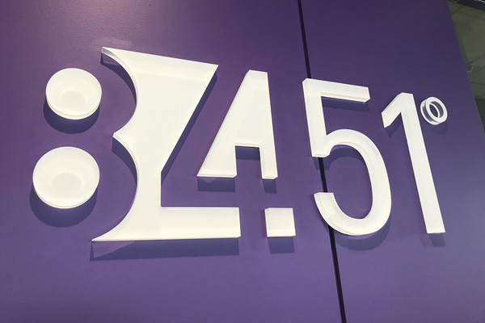
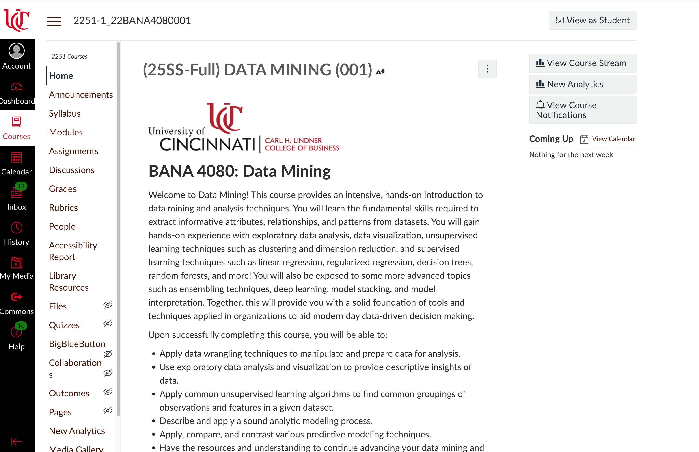
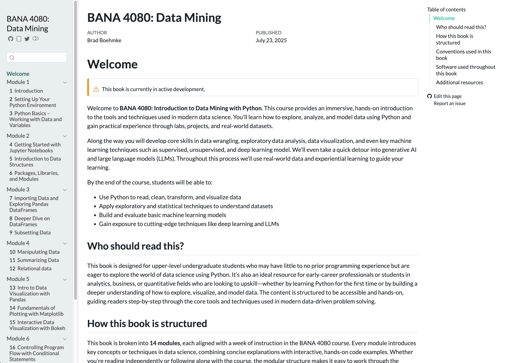
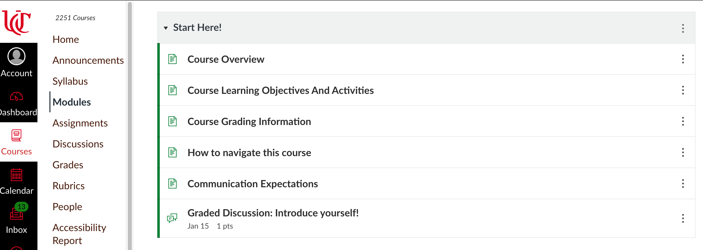
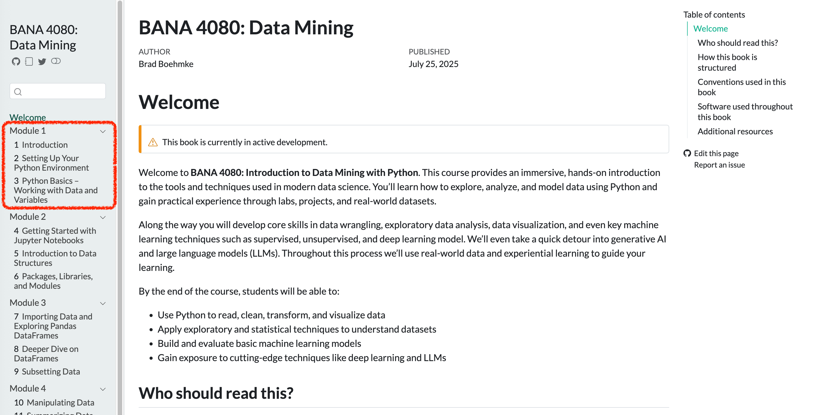

# Welcome to BANA 4080  {background="#43464B"}

## Brad Boehmke {.smaller}

<br>

::: columns
::: {.column width="60%"}
- Phonetically: **"Bem"** + **"Key"**

- Alternatives:
   - Dr. / Professor B
   - Brad


- Contact:
   - Read **Communication Expectations** Canvas page first!
   - Email: boehmkbc@ucmail.uc.edu
   - Office: Lindhall 3412
:::
::: {.column width="40%"}

:::
:::

---

<br><br><br>

:::: columns
::: {.column width="33%"}
{fig-align="center"}
:::
::: {.column width="33%"}
{fig-align="left"}
:::
::: {.column width="33%"}
{fig-align="center"}
:::
::::

---

## Fun Fact: Golf Obsessed

<br>













## Meet Your TA {.smaller}
<br>

### 👋 Eirlys Vo

- Senior in Business Analytics  
- Has already taken this course
- Passionate about helping you succeed  
- Great resource for coding questions, labs, and homework

📧 Email: vopq@mail.uc.edu  
🕐 Office Hours: TBD 

<br>

::: {.callout-important}
Don’t hesitate to reach out — they’re here to support you!
:::

## Today's Agenda

<br>

- What is data mining and why does it matter?
- Course overview, goals, & roadmap
- AI & Tooling
- Q&A

# What is Data Mining  {background="#43464B"}

## Data Mining is All Around Us {.smaller}

> Organizations use data mining to drive decisions every day.

**Real-World Examples:**

- 🛒 *Kroger analyzes loyalty card data* to personalize digital coupons.
- 🎶 *Spotify recommends music* based on your listening history and those like you.
- 🏥 *Hospitals use patient data* to predict readmission risks.
- 🏈 *NFL teams analyze player movement data* to improve performance and strategy.
- 📦 *Amazon tracks browsing behavior* to recommend products and optimize inventory.

. . .

<br>

::: {.callout-important}
[Every time you browse, click, buy, swipe, or stream — you're generating data.]{style="color:blue;"}
:::

## What Is Data Mining? {.smaller}

> **The process of uncovering meaningful patterns, trends, and relationships in large data sets**

Why is it important?

- 📈 Helps organizations **make better decisions**
- 🔍 Reveals insights that would otherwise go unnoticed
- 🤖 Powers personalization, prediction, and automation
- 💰 Drives business value in nearly every industry

<br>

::: {.callout-important}
[Data mining turns raw information into **actionable knowledge**]{style="color:blue;"}
:::

## Activity {.smaller}

::: {.callout}
## Where Do You See Data Mining?

🤔 Think about your daily routine — when are you being “mined”?
:::

:::: {.columns}
::: {.column}
#### Instructions:

1. **Form groups of 2–3 students**
2. Brainstorm at least **3 examples** where you think data mining is happening in your life
3. We’ll share a few examples as a class

💬 Look for clues in:

- Shopping & entertainment
- Health & fitness
- Social media & tech
- Education or travel
:::
::: {.column}

<center>
Please think about this for 5 minutes.

<div id="5minWaiting"></div>
<script src="_extensions/produnis/timer/timer.js"></script>
<script>
    document.addEventListener("DOMContentLoaded", function () {
        initializeTimer("5minWaiting", 300, "slide"); 
    });
</script>
</center>
:::
::::

## So What Does Data Mining Actually Look Like? {.smaller}

> **The process of turning raw, messy data into insight someone can act on**

```{mermaid}
%%| fig-align: center
flowchart LR
  A[Raw Data] --> B[Clean & Prepare]
  B --> C[Explore & Visualize]
  C --> D[Model & Predict]
  D --> E[Insight & Action]
```

Every example you just brainstormed runs through this same pipeline — and this course walks you through it end-to-end.

::: {.callout-important}
[The first half of this course covers **getting data ready**. The second half covers **learning from it**.]{style="color:blue;"}
:::


# The Challenge Ahead {background="#43464B"}

## Meet Taylor {.smaller}

:::: {.columns}
::: {.column width="65%"}
**Taylor** is a college junior who just landed a summer internship at a marketing analytics firm.

**Taylor has a solid foundation:**

- Business knowledge ✓
- Statistical thinking ✓
- Critical thinking ✓

:::
::: {.column width="35%"}
{fig-align="center"}
:::
::::

Taylor knows how to think about data!

## Taylor's First Week on the Job {.smaller}

:::: {.columns}
::: {.column width="65%"}
The manager drops three raw data files and says:

> *"We're trying to understand what drives repeat purchases. Can you dig into this and pull together something useful by Friday?"*

**Taylor opens the files and freezes.** 😰

:::
::: {.column width="35%"}
{fig-align="center"}
:::
::::

**What's missing?** The hands-on ability to take raw, messy data and turn it into insight someone can act on.

<br>

::: {.callout-important}
[**That gap is exactly what this course closes.**]{style="color:blue;"}
:::

# Does this scenario sound familiar?  {background="#43464B"}

## It's your turn to experience this... {.smaller}

:::: {.columns}
::: {.column}
You'll get three datasets:

- 🧾 **Customer Transactions** (messy!)
- 🛒 **Product Information**
- 👥 **Customer Demographics**

:::
::: {.column}
<center>
Download the data from

[https://tinyurl.com/retail-data](https://tinyurl.com/retail-data)
</center>
:::
::::

**Your mission:**

1. Get this data into a form where you can start answering: *"What drives repeat purchases?"*
2. Can you get some initial insights from the data?

## Group Activity: Dig Into the Data {.smaller}

:::: {.columns}
::: {.column}
Work in groups of 2–3. Use any tools you have (Excel, Python, intuition) and try to answer:

- 🛒 Which products have the highest repeat purchase rate?
- 👥 Are certain types of customers buying these products more frequently?
- 📅 Is there a time pattern — do repeat purchases cluster around certain days or weeks?
- 🧹 What data quality issues did you run into? Missing values? Inconsistent formats?
- 🔀 How did you connect information across the three files?
:::
::: {.column}

<center>
Please work on this for 15 minutes.

<div id="15minWaiting"></div>
<script src="_extensions/produnis/timer/timer.js"></script>
<script>
    document.addEventListener("DOMContentLoaded", function () {
        initializeTimer("15minWaiting", 900, "slide");
    });
</script>
</center>

:::
::::

::: {.callout-important}
Don't worry about getting the "right" answer — focus on what's hard about the process.
:::

## Debrief: What Did You Learn? {.smaller}

Let's talk through what you found:

- 🛒 Were you able to identify which products had the highest repeat purchase rate? What made it hard?
- 👥 Did any customer segments stand out? How did you figure that out?
- 📅 Did you find any time patterns — and how did you look for them?
- 🧹 What data quality issues slowed you down?
- 🔀 How did you connect the three files — and what would have helped?

::: {.callout-tip}
If you couldn't complete the task — or didn't know where to start — **that's exactly the point.** By the end of this course, this will feel straightforward.
:::

## Key Takeaways:

- Real-world data is never clean or ready to analyze
- Good data work starts with **understanding the structure and quality** of your data
- This course will teach you to **clean, explore, model, and communicate** insights from messy data with Python

::: {.callout-tip}
*We'll revisit this exact challenge at the end of the semester — and it'll feel completely different.*
:::


# Course Overview  {background="#43464B"}

## Why This Matters for YOUR Career {.smaller}

Data is everywhere — but insight is rare.

**No matter your major, this course gives you a competitive edge:**

:::: {.columns}
::: {.column}
- 📊 **Business Analytics Students** → Speak the language of data science teams
- 📈 **Marketing Majors** → Understand customer behavior through data, not just theory
- 💵 **Finance Majors** → Model risk, detect fraud, forecast performance with code
:::
::: {.column}
- 👩‍💼 **Management Majors** → Lead data-driven decisions instead of following them
- 🎯 **All Majors** → Collaborate effectively with technical teams
:::
::::

<br>

::: {.callout-important}
[Today's business leaders are expected to be **data-literate decision makers**]{style="color:blue;"}
:::

## What You'll Learn in BANA 4080 {.smaller}

```{mermaid}
%%| fig-align: center
flowchart LR
  subgraph DM[Data Mining]
    direction LR
    subgraph Data
    end
    subgraph Cleaning
    end
    subgraph Wrangling
    end
    subgraph EDA
    end
    subgraph Modeling
    end
    subgraph Interpretation
    end
  end
  A[Stakeholders] --> DM
  B[Organizational Requirements] --> DM
  DM --> Decisions --> Value
  Data --> Cleaning --> Wrangling --> EDA --> Modeling --> Interpretation
  Interpretation --> Data
```

By the end of this course, you'll be able to:

- Write basic Python code to work with data
- Clean, wrangle, and analyze messy real-world datasets
- Visualize insights clearly and effectively
- Understand how various ML/AI models are used in organizations
- Build simple ML/AI models for prediction and pattern discovery
- Communicate data-driven findings to others

. . .

::: {.callout-important}
[This course is not about memorizing syntax — it's about **thinking with data**]{style="color:blue;"}
:::

# AI Reality Check {background="#43464B"}

## What About AI? Won't It Do This for Me? {.smaller}

> *"Why do I need to learn coding when ChatGPT can just do it for me?"*

It's a fair question. Let's talk about it honestly.

:::: {.columns}
::: {.column width="65%"}
🤖 **AI tools are incredible accelerators**, but they're not magic:

- They don't **understand your business context**
- They can't **ask the right questions** about your data
- They sometimes just **make stuff up**
- They're only as good as **your prompts and interpretation**
:::
::: {.column width="35%"}
{fig-align="center"}
:::
::::

## AI Reality Check: It's Like Autocorrect for Code! {.smaller}

::: {.callout-warning}
**Ever had your phone turn "on my way!" into "omg my weasel!"?** 🦫

That's exactly how AI coding tools work — they predict what comes next based on patterns they've seen.

Sometimes they nail it... sometimes you get digital weasels.
:::

. . .

**AI tools are assistants, not autopilots:**

:::: {.columns}
::: {.column}
✅ **AI can help you:**

- Write boilerplate code
- Debug errors
- Learn new syntax
- Generate ideas
:::
::: {.column}
❌ **AI cannot:**

- Understand YOUR data
- Know YOUR business goals
- Ask the right questions
- Guarantee correct answers
:::
::::

## How We'll Use AI in This Course {.smaller}

You'll learn to use AI tools **as learning partners, not crutches:**

::: {.columns}
::: {.column}
**✅ Smart AI Use:**

- Check your understanding
- Help debug when stuck
- Explain concepts differently
- Generate practice examples
- **Always understand what the code does**
:::
::: {.column}
**❌ Avoid This:**

- Copy-paste without understanding
- Skip the learning struggle
- Rely on AI for everything
- Submit AI code you can't explain
:::
:::

. . .

::: {.callout-important}
[The future belongs to people who know how to **collaborate with AI**, not be replaced by it.]{style="color:blue;"}
:::


# Course Roadmap & Learning Mindset {background="#43464B"}

## Learning to Code: A Reality Check {.smaller}

**Let's be honest** — learning to code can be frustrating at first.

:::: {.columns}
::: {.column}
**You might feel:**

- 😤 Confused by error messages
- 🤯 Like everyone else "gets it" but you
- 😮‍💨 Stuck on simple problems
- 🙄 Like you're just copying examples

**This is normal. It's expected.**
:::
::: {.column}
{fig-align="center"}
:::
::::

. . .

::: {.callout-tip}
## Learning to Code = Learning a New Language

You'll start by copying examples and Googling errors.

Over time, you'll stop memorizing and start **thinking** in code.
:::

**This course is designed for beginners** — we'll get you there step by step!

# Course Roadmap  {background="#43464B"}

## Course Roadmap {.smaller}

Your journey through BANA 4080:

1. **Weeks 1–3**: Python basics & Working with data
2. **Weeks 3–4**: Data wrangling & Exploratory analysis
3. **Weeks 5-6**: Data visualization & Efficient programming
4. **Week 7**: Mid-term
5. **Weeks 8-12**: ML & AI
6. **Weeks 13-14**: Final project

::: {.callout-important}
[This course builds your skills step-by-step — like a training plan for thinking with data.]{style="color:blue;"}
:::

## How You’ll Learn {.smaller}

Each week follows a consistent rhythm:

- 🧠 **Tuesday (Lecture):** Learn concepts, explore examples, discuss ideas
- 💻 **Thursday (Lab):** Practice coding, get hands-on, work with real data

Assessments include:

- 📚 Weekly reading quizzes  
- 📝 Biweekly homework assignments  
- 💭 Discussion forums
- 📊 Midterm and final project
- ❌ No conventional tests!

::: {.callout-important}
[Expect to build something meaningful — not just learn theory.]{style="color:blue;"}
:::

## Resources {.smaller}

Everything You Need Is in One of Two Spots

<br>

::: {.columns}
::: {.column width="50%"}

#### 📍 Course Canvas Page  

{fig-align="center"}

:::

::: {.column width="50%"}

#### 📘 Course Textbook  

{fig-align="center"}

:::
:::

:::footer
Book: [https://bradleyboehmke.github.io/uc-bana-4080/](https://bradleyboehmke.github.io/uc-bana-4080/)
:::

## Step 1

::: {.callout}
Who has read through the ["Start Here!"]{style="color:red;"} module?
:::



. . .

::: {.callout}
Let's hit on a few important items
:::

# Tools & Setup Preview  {background="#43464B"}

## Why Learn to Code? 🤔

. . .

:::: {.columns}
::: {.column}

<br>

- Coding = flexibility + power
- Handle real-world data: big, messy, inconsistent
- Automate repetitive tasks
- Think algorithmically and analytically
:::
::: {.column}

:::
::::


## Why Python? 🤔 {.smaller}

:::: {.columns}
::: {.column}

<br>

- Widely used
- Easy-to-read syntax (great for beginners)
- Massive ecosystem: pandas, numpy, matplotlib, scikit-learn
- Community support: tutorials, libraries, AI tools
- **Most organizations are shifting toward Python** as the primary language for their **data science and engineering codebases**

:::
::: {.column}

{width="75%" fig-align="center"}

:::
::::

::: {.callout-important}
Python is the most valuable tool in your analytics toolbox.
:::

## How You'll Run Python: Google Colab {.smaller}

:::: {.columns}
::: {.column width="60%"}
#### What is Colab?

- 💻 Free cloud-based Python environment from Google
- 🚫 No software installation needed to get started
- ✅ Works in your browser – just click and code

#### Why Colab First?

- Easy, consistent experience for everyone on Day 1
- Allows us to focus on learning — not debugging installs
- We’ll gradually move toward installing tools locally (e.g., Anaconda, Jupyter, VS Code)
:::
::: {.column width="40%"}

:::
::::

::: {.callout-important}
You’ll be up and coding on Day 1 — no setup headaches!
:::

# Next Steps  {background="#43464B"}

## Your Learning Journey Starts Now {.smaller}

**📖 What Next?**

:::: {.columns}
::: {.column width="60%"}
1. Read the "Start Here!" module
2. Start working through Module 1's readings - **Chapters 1-3**
3. Get up and running in Colab

**🗓️ Thursday Lab:**

- Your **first Python code**
- Working in **Google Colab**
- **Collaborative problem-solving**

**💡 Remember:** We're building skills step-by-step!
:::
::: {.column width="40%"}

:::
::::


# Q&A  {background="#43464B"}

## Q&A 🙋‍♀️

- Open floor for any questions regarding the course structure, expectations, or content.
- Discussion on how this course aligns with your academic and career goals.
- Or anything else...golf?