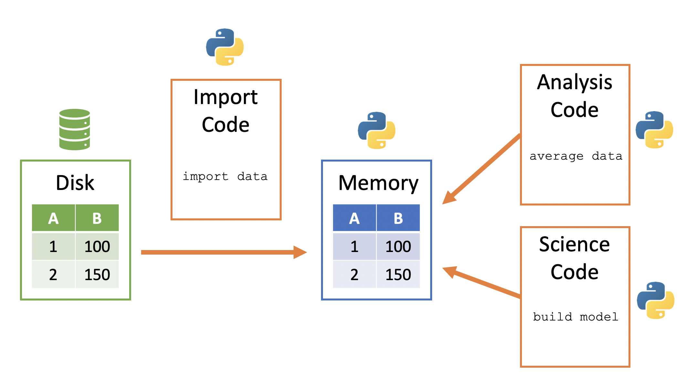
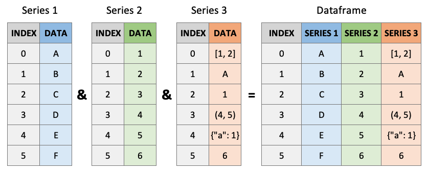
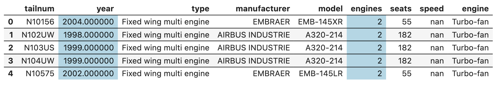
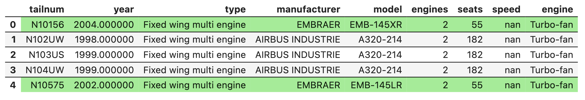

## Welcome Data Detectives! 🔍

**Today's Mission:**

- Learn to import real-world datasets
- Master DataFrame investigation techniques  
- Discover the power of data subsetting

# Discussion: Last Week's Content {background="#43464B"}

## Questions from Week 2? {.smaller}

Let's take a few minutes to address any questions or concerns from last week before diving into new material.

::: {.callout}
## Share with the Class

**Open floor for questions about:**

- Variables, data types, and operations
- Jupyter notebooks and Python basics
- Homework assignments or exercises
- Any concepts that felt confusing
- How to approach problem-solving in Python

**Don't hesitate to ask - chances are others have the same questions!**
:::

::: {.callout-tip}
## Stuck on a homework problem?

Let me know which one — we can work through it together in Thursday's lab.
:::

# Experience First: The Spreadsheet Challenge {background="#43464B"}

## Try This! {.smaller}

**Your Task:** Find the **average number of seats** on aircraft manufactured by **Embraer** in **2004 or later**

:::: {.columns}
::: {.column width="70%"}

1. Download and open: [https://tinyurl.com/42nartw7](https://tinyurl.com/42nartw7)
2. Use Excel, Google Sheets, or any spreadsheet tool
3. Try to answer the question using filters, sorting, or manual search

**Reflect while you work:**

- How long is this taking?
- What if this had 1 million rows?
- Could you easily repeat this process?

:::
::: {.column width="30%"}

<center>

<div id="5minChallenge"></div>
<script src="_extensions/produnis/timer/timer.js"></script>
<script>
    document.addEventListener("DOMContentLoaded", function () {
        initializeTimer("5minChallenge", 300, "slide"); 
    });
</script>
</center>

:::
::::

**Let's see what people found...**


## 📓 Follow Along in the Notebook

::: {.callout-tip}
## Week 3 Lecture Notebook

Open the companion notebook in Colab now and follow along as we work through today's examples on importing data, exploring DataFrames, and subsetting rows and columns.

[](https://colab.research.google.com/github/bradleyboehmke/uc-bana-4080/blob/main/notebooks/tuesday-your-turn/week-03-lecture.ipynb)
:::

# Getting Data Into Python {background="#43464B"}

## The Data Journey: From Disk to Detective Work {.smaller}

Python stores data in **memory** for fast analysis, but first we need to get it there!

:::: {.columns}
::: {.column}

**The Process:**

1. Data sits on your computer's **"disk"** (hard drive)
2. Python copies the file into **memory** (RAM)
3. You can now investigate and analyze!

:::
::: {.column}



:::
::::

::: {.callout-important}
## Copied, not connected

Importing **copies** the data into your Python session — it does not open a live link to the file.

This matters most in **Colab**, where your session runs on a temporary cloud machine: when you close the notebook or the runtime restarts, that copy is gone. Same idea locally — close Python, and the data in memory disappears.

**The takeaway:** every session starts by re-importing your data. That's not a chore, it's what makes your analysis reproducible.
:::

## Your Detective Toolkit: Pandas 🐼 {.smaller}

**Meet Pandas:** Python's most powerful tool for working with spreadsheet-like data

:::: {.columns}
::: {.column}
**Pandas enables:**

- **Importing** data from files like CSV and Excel
- **Exploring** and understanding datasets
- **Cleaning** and transforming messy data
- **Filtering** and subsetting rows/columns
- **Analyzing** and summarizing information

:::
::: {.column}
::: {.callout-tip}
🧠 **Think of Pandas as:**

Excel + Python power = Reproducible & scalable data analysis

[Pandas Documentation](https://pandas.pydata.org/docs/)
:::
:::
::::

## Let's Import Our First Dataset! {.smaller}

**Step 1:** Import pandas and load the Ames housing data

```{python}
import pandas as pd

# Load the real estate data straight from the course repo
url = "https://raw.githubusercontent.com/bradleyboehmke/uc-bana-4080/main/data/ames_raw.csv"
ames = pd.read_csv(url)
```

. . .

<br>

**Working from a local file instead?** `read_csv()` takes a file path just as happily as a URL:

:::: {.columns}
::: {.column width="52%"}
```python
# Absolute path — full address from the root
pd.read_csv("/Users/jane/project/data/ames_raw.csv")

# Relative path — directions from where you are
pd.read_csv("../data/ames_raw.csv")
```
:::
::: {.column width="48%"}
```
my_project/
├── notebooks/
│   └── analysis.ipynb  ← You are here
└── data/
    └── ames_raw.csv    ← Your data
```

:::
::::

::: {.callout-tip}
**Pro tip:** Prefer relative paths over absolute ones — they're easier to share and maintain with co-workers.
:::

## Importing Data in Google Colab ☁️ {.smaller}

**The challenge:** In Colab, your files aren't on your local machine — they're on a cloud VM.

**Option 1: Load directly from a URL** — what we just did

Because we read from a URL, that import ran the same way on your laptop and in Colab. This is the approach we'll use most this term.

**Option 2: Upload a local file** — for data that isn't online
```python
from google.colab import files

# Opens a file picker — select a file from your computer
uploaded = files.upload()
```

Then read the uploaded file just like any local file:

```python
ames = pd.read_csv('ames_raw.csv')
```

::: {.callout-warning}
Files uploaded this way **only persist for the current Colab session**. If you close the browser or restart your runtime, you'll need to re-upload.
:::

# Getting to Know Your Data 🧐 {background="#43464B"}

## Meet Your Data {.smaller .scrollable}

Here's what we just imported:

```{python}
ames
```

## Size It Up Yourself {.smaller}

Pandas gives you a whole toolkit for getting to know a new dataset — run each of these in your notebook and read what comes back:

```python
ames.shape       # How big is it?
ames.columns     # What are the columns called?
ames.dtypes      # What type is each column?
ames.head()      # What do the first rows look like?
ames.info()      # Types and missing values, all at once
ames.describe()  # Summary statistics for numeric columns
```

::: {.callout-tip}
Don't just run them — *read* the output. Anything surprise you?
:::

## Attributes vs Methods: Your Detective Tools {.smaller}

**Pop Quiz:** Do you notice a difference between these commands?

:::: {.columns}
::: {.column}
```python
ames.shape      # No parentheses
ames.columns    # No parentheses  
ames.dtypes     # No parentheses
```

**Attributes** = Looking at the "ID card"

- Basic properties of your data
- No parentheses needed
:::
::: {.column}
```python
ames.head()     # With parentheses
ames.info()     # With parentheses
ames.describe() # With parentheses
```

**Methods** = Asking questions

- Functions that DO something
- Always need parentheses
:::
::::

::: {.callout-tip}
**Memory Trick:** Methods = Actions = Parentheses!
:::

## Why Inspect Before You Analyze {.smaller}

Those six commands take about ten seconds. Skipping them costs hours.

:::: {.columns}
::: {.column}
**What you're really checking:**

- **`.shape`** — did every row load, or did the file get truncated?
- **`.dtypes`** — is `SalePrice` actually numeric, or did pandas read it as text because one cell had a stray character?
- **`.info()`** — which columns have missing values, and how many?
- **`.describe()`** — any impossible values? A minimum of 0, a maximum of 999999?
:::
::: {.column}
::: {.callout-important}
## The real point

Every dataset arrives with a story attached — *"this is last year's sales."*

Inspection is how you check whether the data matches the story **before** you build an analysis on top of it.
:::
:::
::::

::: {.callout-tip}
**Golden Rule:** `.shape`, `.info()`, `.describe()` — every time, before anything else.
:::

# Understanding DataFrames & Series {background="#43464B"}

## DataFrames: Your Digital Spreadsheet {.smaller .scrollable}

A **DataFrame** is like an Excel spreadsheet in Python:

:::: {.columns}
::: {.column}
- **2D structure** (rows × columns)
- **Labeled rows** (index)
- **Named columns** 
- Each column is a **Series**
- Built for data analysis

:::
::: {.column}
{width="90%"}
:::
::::

```{python}
# Let's look at our Ames data again
ames
```

## Quick Challenge! 🎯

**Prediction Game:** What will each of these return?

:::: {.columns}
::: {.column}
**Single brackets:**
```python
ames['SalePrice']
```

**Double brackets:**
```python
ames[['SalePrice']]
```

**Multiple columns:**
```python
ames[['SalePrice', 'Year Built']]
```
:::
::: {.column}
**Think about:**

- What do `[]` do?
- What do you think the output values will be?
- What do you think the output types will be?

:::
::::

## The Answer Revealed! {.smaller}

Same column, three different requests — look at how the output *shape* changes:

:::: {.columns}
::: {.column width="33%"}
**Single brackets → Series**

<br>

```{python}
ames['SalePrice'].head(3)
```
:::
::: {.column width="33%"}
**Double brackets → DataFrame**

```{python}
ames[['SalePrice']].head(3)
```
:::
::: {.column width="34%"}
**Two columns → DataFrame**

<br>

```{python}
ames[['SalePrice', 'Year Built']].head(3)
```
:::
::::

::: {.callout-note}
**What's actually happening:** the outer `[ ]` is pandas' selection syntax — the inner `[ ]` is just a plain Python **list**.

So `ames[['SalePrice']]` is really `ames[ ]` handed the list `['SalePrice']`. And because it's an ordinary list, you can keep adding to it — `['SalePrice', 'Year Built', 'Neighborhood']` — which is exactly why double brackets scale to as many columns as you want, and single brackets don't.
:::

## Why Should You Care? {.smaller .scrollable}

**Rule #1 — always know which one you're holding.** 

:::: {.columns}
::: {.column}
**A Series** — one column, with a `dtype:` footer underneath and **no header row**:

```{python}
ames['SalePrice'].head(3)
```

Three parts: **values**, **index**, and a single **dtype**.
:::
::: {.column}
**A DataFrame** — a **table with a header row**, even holding just one column:


```{python}
ames[['SalePrice']].head(3)
```

:::
::::

::: {.callout-tip}
Luckily, you can tell at a glance!
:::

## Why Should You Care? {.smaller .scrollable}

**Rule #2 — they don't share the same toolkit.**

Sometimes the *same* attribute or method works on both, but hands back **different output**:

```{python}
print("Series .shape:   ", ames['SalePrice'].shape)
print("DataFrame .shape:", ames[['SalePrice']].shape)
```

```{python}
ames['SalePrice'].mean()      # one number
```

```{python}
ames[['SalePrice']].mean()    # a Series — note the dtype: footer!
```

```{python}
ames[['SalePrice', 'Year Built']].mean()   
```

. . .

Other times an attribute or method exists for one and simply **isn't there** on the other:

```python
ames['SalePrice'].columns    # ❌ AttributeError — a Series has no columns
ames[['SalePrice']].columns  # ✅ Index(['SalePrice'], dtype='object')
```

::: {.callout-important}
**Key Rule:** Reach for `[[ ]]` when you want to keep working like a DataFrame — selecting several columns, chaining, joining, or writing back out to a file.
:::

## Your Turn! 🎯 {.smaller .scrollable}

:::: {.columns}
::: {.column width="65%"}

Using the `ames` DataFrame:

1. Extract the `Neighborhood` column as a **Series**. What neighborhood are the first 3 records in?
2. Extract the `Neighborhood` column as a **DataFrame**.
3. Extract the `Neighborhood`, `Overall Qual`, and `SalePrice` columns as a **DataFrame**.

:::
::: {.column width="35%"}

<center>

<div id="3minYourTurn"></div>
<script src="_extensions/produnis/timer/timer.js"></script>
<script>
    document.addEventListener("DOMContentLoaded", function () {
        initializeTimer("3minYourTurn", 180, "slide");
    });
</script>
</center>

:::
::::

::: {.fragment}
**1 — One name in `[ ]` gives a Series.** The first three records are all in **NAmes** (North Ames):

```{python}
ames['Neighborhood'].head(3)
```
:::

::: {.fragment}
**2 — Wrap that same name in a list to get a DataFrame back:**

```{python}
ames[['Neighborhood']].head(3)
```
:::

::: {.fragment}
**3 — Keep adding to the list:**

```{python}
ames[['Neighborhood', 'Overall Qual', 'SalePrice']].head(3)
```
:::

# Data Subsetting: Finding What Matters {background="#43464B"}

## The Two Dimensions of Subsetting {.smaller}

When analyzing data, you often want just a **subset** of your dataset:

:::: {.columns}
::: {.column width="50%"}
**Dimension 1: Select Columns**


*"I only care about year and engines"*
:::
::: {.column width="50%"}
**Dimension 2: Filter Rows**


*"I only want aircraft built after 2000"*
:::
::::

. . . 

<br>

:::: {.columns}
::: {.column}
*(Translates to Ames data: "I only care about price and year built")*
:::
::: {.column}
*(Translates to Ames data: "I only want houses built after 2000")*
:::
::::

## Selecting Columns: Pick Your Variables {.smaller .scrollable}

**You already know how to do this!**

**One column → Series**

```{python}
ames['SalePrice'].head(3)
```

**Two columns → DataFrame**

```{python}
ames[['SalePrice', 'Year Built']].head(3)
```

**Three columns → DataFrame**

```{python}
ames[['SalePrice', 'Year Built', 'Neighborhood']].head(3)
```

::: {.callout-tip}
Notice the pattern: the list just keeps growing. Want a fourth column? Add it to the list. The only real decision is **one name in `[ ]`** (a Series) versus **a list in `[[ ]]`** (a DataFrame, however many columns).
:::

## Data Mystery #1 🕵️ {.smaller .scrollable}

**Challenge:** Using our Ames dataset, can you find:

:::: {.columns}
::: {.column}
1. How many houses are in our dataset?
2. What's the highest sale price?
3. What's the average year built?
4. How many **unique neighborhoods** are represented?

**Detective Tools:**

- `.shape`
- `.max()`
- `.mean()`
- `.nunique()`

:::
::: {.column}
<center>

<div id="5minMystery1"></div>
<script src="_extensions/produnis/timer/timer.js"></script>
<script>
    document.addEventListener("DOMContentLoaded", function () {
        initializeTimer("5minMystery1", 300, "slide"); 
    });
</script>
</center>

::: {.callout-tip}
**Hint:** Can't remember what a column is called? `ames.columns` will list every one of them.
:::

:::
::::

**Let's see what you discovered...**

## Data Mystery #1 Solutions 🎯 {.smaller}

:::: {.columns}
::: {.column}
**Mystery 1: How many houses?**
```{python}
# Check dataset dimensions
print(f"Dataset shape: {ames.shape}")
print(f"Number of houses: {ames.shape[0]}")
```

**Mystery 2: Highest sale price?**
```{python}
# Find maximum sale price
highest_price = ames['SalePrice'].max()
print(f"Highest sale price: ${highest_price:,}")
```
:::
::: {.column}
**Mystery 3: Average year built?**
```{python}
# Calculate average year built
avg_year = ames['Year Built'].mean()
print(f"Average year built: {avg_year:.0f}")
```

**Mystery 4: Unique neighborhoods?**
```{python}
# Count the distinct values in the column
n_hoods = ames['Neighborhood'].nunique()
print(f"Unique neighborhoods: {n_hoods}")
```

:::
::::

::: {.callout-tip}
**Detective Skills Unlocked!** 🔓

You now know how to:

- Check dataset size with `.shape`
- Find maximum values with `.max()`
- Calculate averages with `.mean()`
- Count distinct values with `.nunique()`
:::

## Filtering Rows: The Magic of Conditions {.smaller}

**The Process:** Ask a yes/no question about each row

:::: {.columns}
::: {.column}
**Step 1:** Create a condition (True/False for each row)
```{python}
#| code-line-numbers: "2"
# Which houses sold for more than $200,000?
expensive_houses = ames['SalePrice'] > 200000
expensive_houses
```

This creates a **boolean Series** - True/False for each row!
:::
::: {.column}
**Step 2:** Use the condition to filter
```{python}
#| code-line-numbers: "2"
# Keep only the True rows
filtered_ames = ames[expensive_houses]
print(f"Original dataset: {ames.shape[0]} houses")
print(f"Expensive houses: {filtered_ames.shape[0]} houses")
filtered_ames.head()
```

Now we have a **filtered DataFrame** with only expensive houses!
:::
::::

## Building More Complex Filters {.smaller .scrollable}

**Real Estate Question:** Find houses that are **expensive** AND **recently built**

```{python}
#| code-line-numbers: "2,3,6,9"
# Step 1: Define our conditions
expensive = ames['SalePrice'] > 200000
recent = ames['Year Built'] > 2000

# Step 2: Combine with & (AND)
expensive_and_recent = expensive & recent

# Step 3: Filter the data
result = ames[expensive_and_recent]
print(f"Expensive AND recent houses: {result.shape[0]}")
```

::: {.callout-warning}
**Important:** Always use `&` for AND and `|` for OR with pandas (not `and`/`or`)
:::

::: {.fragment}
**Another Real Estate Question:** Find houses at either end of the market — **inexpensive** (under \$100,000) OR **expensive** (over \$500,000)

```{python}
#| code-line-numbers: "2,3,6,9"
# Step 1: Define our conditions
inexpensive = ames['SalePrice'] < 100000
expensive = ames['SalePrice'] > 500000

# Step 2: Combine with | (OR)
either_extreme = inexpensive | expensive

# Step 3: Filter the data
result = ames[either_extreme]
print(f"Inexpensive: {inexpensive.sum()}  |  Expensive: {expensive.sum()}")
print(f"Either extreme: {result.shape[0]}")
```

::: {.callout-note}
Notice the difference: `&` **narrows** your results — a row must satisfy *both* conditions. `|` **widens** them — a row only needs *one*. Here no house can be under \$100k and over \$500k at once, so the two groups don't overlap and the counts simply add up.
:::
:::

## The Powerful .loc Accessor {.smaller .scrollable}

So far we've treated our two dimensions separately — **pick columns**, or **filter rows**. In practice you almost always want them *at the same time*:

> *"Give me the neighborhood, price, and size — but only for the homes I actually care about."*

You could do it in two steps, filtering and then selecting. `.loc[]` does both in one:

::: {.callout-tip}
**Pattern:** `df.loc[rows, columns]` — the row condition first, the column list second.
:::

**Why `.loc`?** Cleaner, more explicit, avoids pandas warnings — and it's what you'll see in professional code.

. . .

**Example 1 — Recent *and* expensive.** Neighborhood, price, and living area for homes built after 2000 **and** sold above \$200,000:

```{python}
#| code-line-numbers: "1,2,4"
rows = (ames['Year Built'] > 2000) & (ames['SalePrice'] > 200000)
cols = ['Neighborhood', 'SalePrice', 'Gr Liv Area']

recent_expensive = ames.loc[rows, cols]
print(f"Matching homes: {recent_expensive.shape[0]}")
recent_expensive.head(3)
```

. . .

**Example 2 — Either end of the market.** Same three columns, but for homes under \$100,000 **or** over \$500,000:

```{python}
#| code-line-numbers: "1,2,4"
rows = (ames['SalePrice'] < 100000) | (ames['SalePrice'] > 500000)
cols = ['Neighborhood', 'SalePrice', 'Gr Liv Area']

price_extremes = ames.loc[rows, cols]
print(f"Matching homes: {price_extremes.shape[0]}")
price_extremes.head(3)
```

::: {.callout-note}
Recognize that **254**? It's the same set of houses we found on the previous slide — except now we're getting back just the three columns we asked for instead of all 82.
:::

## Data Mystery #2 🕵️‍♀️ {.smaller .scrollable}

**Your Challenge:** A developer wants to know where the market for **newer, larger homes** actually is.  Work these in order — each step builds on the one before it:

:::: {.columns}
::: {.column}
1. Use **`.loc[]`** to pull the `Neighborhood`, `Year Built`, `Gr Liv Area`, and `SalePrice` columns for homes built in **2000 or later** *and* **3,000 sq ft or larger**.
2. **How many homes** meet that condition?
3. For those homes: what's the **average sale price**, and **how many different neighborhoods** do they span?

:::
::: {.column}
<center>

<div id="5minMystery2"></div>
<script src="_extensions/produnis/timer/timer.js"></script>
<script>
    document.addEventListener("DOMContentLoaded", function () {
        initializeTimer("5minMystery2", 300, "slide"); 
    });
</script>
</center>

:::
::::

::: {.callout-tip}
**Hint:** Save your `.loc[]` result to a variable — then steps 2 and 3 are one short line each.

**Detective Tools:** `.loc[]` · `.shape` · `.mean()` · `.nunique()`
:::


## Data Mystery #2 Solutions 🎯 {.smaller .scrollable}

**Step 1 — filter rows and select columns in one move:**

```{python}
#| code-line-numbers: "1,2,4"
rows = (ames['Year Built'] >= 2000) & (ames['Gr Liv Area'] >= 3000)
cols = ['Neighborhood', 'Year Built', 'Gr Liv Area', 'SalePrice']

new_large = ames.loc[rows, cols]
new_large.head(3)
```

. . .

**Step 2 — how many homes?**

```{python}
print(f"Homes built 2000+ at 3,000+ sq ft: {new_large.shape[0]}")
```

. . .

**Step 3 — now ask questions of that subset:**

```{python}
avg_price = new_large['SalePrice'].mean()
n_hoods = new_large['Neighborhood'].nunique()

print(f"Average sale price: ${avg_price:,.0f}")
print(f"Spanning {n_hoods} of the {ames['Neighborhood'].nunique()} neighborhoods in Ames")
```

::: {.callout-important}
**That last number is the real finding.** Homes this new *and* this large exist in just **4 of 28** neighborhoods — the top of this market is concentrated in a handful of places. Our developer now knows where this market is concentrated.

Notice the workflow: **subset first, then analyze.** Once `new_large` exists, every follow-up question is a one-liner.
:::


## Common Detective Mistakes 🚨 {.smaller}

**Avoid these rookie errors:**

:::: {.columns}
::: {.column}
**❌ Forgetting parentheses:**
```python
ames.head     # Returns function, not data
ames.head()   # ✅ Returns first 5 rows
```

**❌ Case sensitivity:**
```python
ames['saleprice']  # ❌ KeyError!
ames['SalePrice']  # ✅ Correct spelling
```

**❌ Wrong logical operators:**
```python
ames[(SalePrice > 200000) and (ames['Year Built'] > 2000)]  # ❌
ames[(ames['SalePrice'] > 200000) & (ames['Year Built'] > 2000)]    # ✅
```
:::
::: {.column}
**❌ Confusing brackets:**
```python
ames['SalePrice']    # Series
ames[['SalePrice']]  # DataFrame
```

**❌ Forgetting column references:**
```python
ames[Year Built > 2000]        # ❌ NameError
ames[ames['Year Built'] > 2000] # ✅ Correct
```

::: {.callout-tip}
**Pro Tip:** Use `.columns` to check exact column names!
:::
:::
::::

# Putting It All Together {background="#43464B"}

## Real-World Detective Work Challenge! {.smaller}

**Back to our original challenge:** Let's solve it the Python way!

**Your Task:** Find the **average number of seats** on aircraft manufactured by **Embraer** in **2004 or later**

```{python}
# Load the planes dataset
planes_url = "https://raw.githubusercontent.com/bradleyboehmke/uc-bana-4080/main/data/planes.csv"
planes = pd.read_csv(planes_url)

# Take a quick look at the data structure
planes.head()
```

**Now it's your turn!** Write Python code to:
1. Filter for Embraer aircraft built in 2004 or later
2. Calculate the average number of seats

**Hint:** Remember to use `.loc[]` for filtering and `.mean()` for averages!

**Compare this experience to your earlier spreadsheet work...**

## The Python Solution 🎯 {.smaller}

**Complete Solution:** Here's how to solve it step by step

```{python}
#| code-line-numbers: "1-5,8-9"
# Step 1: Filter for Embraer aircraft built in 2004 or later
embraer_recent = planes.loc[
    (planes['manufacturer'] == 'EMBRAER') & (planes['year'] >= 2004)
]

print(f"Found {embraer_recent.shape[0]} matching aircraft")

# Step 2: Calculate the average number of seats
avg_seats = embraer_recent['seats'].mean()

print(f"Average seats on Embraer aircraft (2004+): {avg_seats:.1f}")

# Bonus: Let's see the range too
print(f"Seat range: {embraer_recent['seats'].min()} to {embraer_recent['seats'].max()}")
```

::: {.callout-tip}
**Python vs Spreadsheet:** 

- **Spreadsheet:** Manual filtering + manual calculation = prone to errors
- **Python:** Automated, reproducible, scalable to millions of rows! 
:::

## 🧾 What You Learned {.smaller .scrollable}

| Code | What it does |
|------|--------------|
| `pd.read_csv(url)` / `pd.read_csv(path)` | Reads a CSV into a DataFrame — copies it into memory **for this session only** |
| `df.shape` | How big is it? Rows and columns, as a tuple |
| `df.head()` | Peek at the first 5 rows |
| `df.columns` | Every column name — your lookup when you forget one |
| `df.dtypes` | The data type of each column |
| `df.info()` | Types *and* missing-value counts, in one summary |
| `df.describe()` | Summary statistics for the numeric columns |
| `df['col']` | One column, as a **Series** |
| `df[['col']]` | One column, as a **DataFrame** |
| `df[['a', 'b', 'c']]` | Several columns — the inner `[ ]` is just a Python list |
| `df[df['col'] > value]` | Keeps only the rows where the condition is `True` |
| `&` and <code>&#124;</code> | Combine conditions — `&` **narrows** (AND), <code>&#124;</code> **widens** (OR) |
| `df.loc[rows, cols]` | Filter rows **and** select columns in a single step |
| `s.mean()` · `s.max()` · `s.min()` | Collapse a column down to one number |
| `s.nunique()` | How many *distinct* values a column holds |

::: {.callout-important}
**The two ideas underneath all of it:**

1. **Know what you're holding.** One name in `[ ]` gives you a Series; a list in `[[ ]]` gives you a DataFrame — and they don't share the same toolkit.
2. **Subset first, then analyze.** Narrow to the rows and columns that matter, *then* ask your questions of that subset.
:::

# Thursday's Lab Preview {background="#43464B"}

## Get Ready for Hands-On Detective Work!

::: {.callout-tip}
## This Week's Lab: Data Detective Training

**You'll practice:**

- Importing multiple datasets
- Exploring real-world messy data
- Solving data mysteries with filtering
- Building detective workflows

**Dataset:** COVID-19 college data - help universities understand their data!
:::

**Come prepared with questions about anything that felt confusing today!**

## Any Final Questions? 🙋‍♀️ {.smaller}

**About today's concepts:**

- Data importing or file paths?
- DataFrame vs Series confusion?
- Filtering or selection techniques?
- About Thursday's lab?
- Questions from last week's homework assignment?
- Upcoming assignments?
