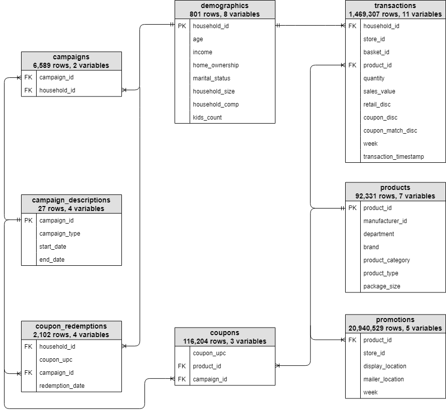
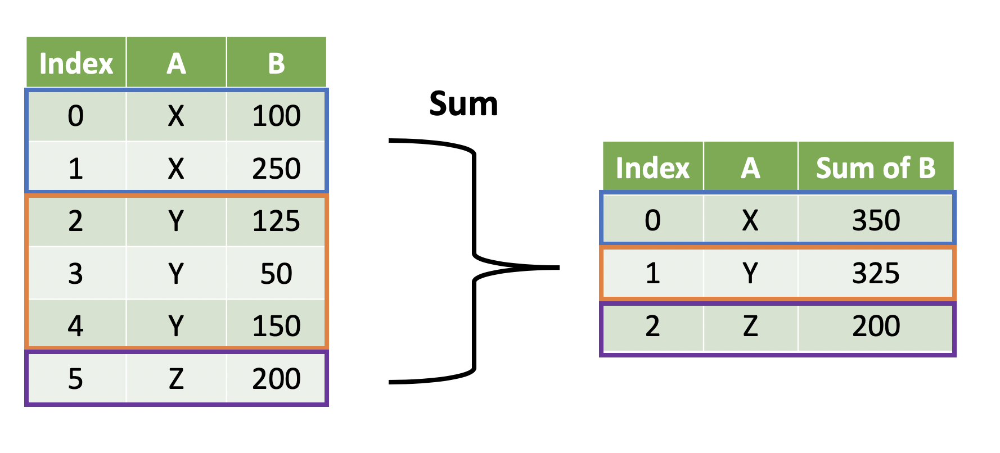
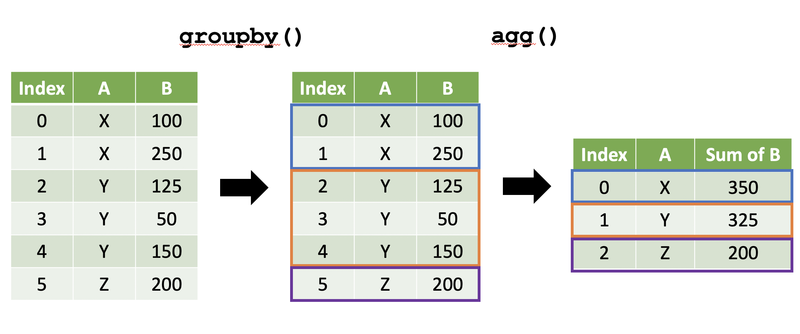
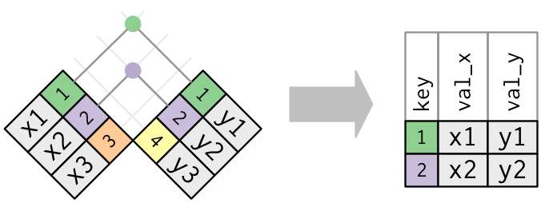
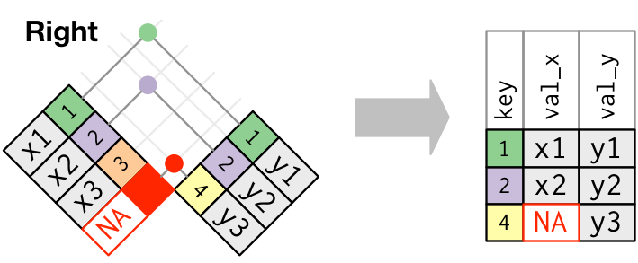
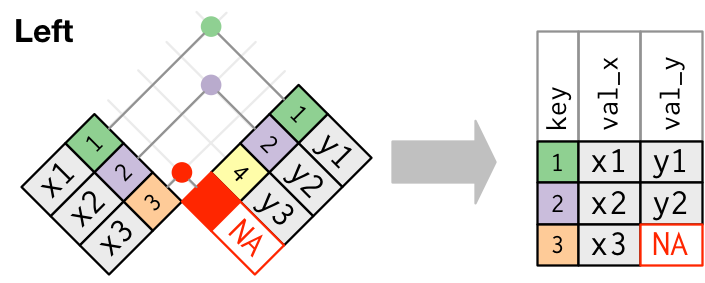
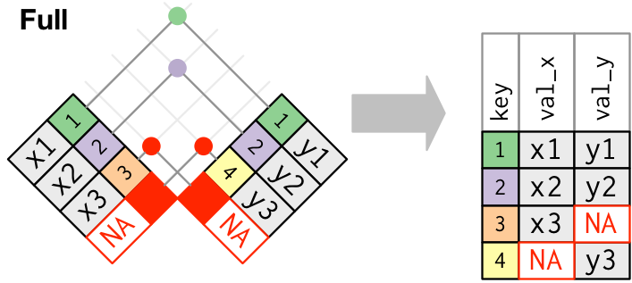

## Welcome to Week 4

**Today's plan:**

- Week 3 questions
- Meet the Complete Journey data
- **Manipulating** data
- **Summarizing** data
- **Joining** data

## Questions from Week 3? {.smaller}

::: {.callout}
## Share with the Class

**Open floor for questions about:**

- DataFrames vs. Series
- Selecting columns, filtering rows, and `.loc[]`
- The homework, quiz, or last Thursday's lab
:::

::: {.callout-tip}
## Stuck on a homework problem?

Let me know which one — we can work through it together in Thursday's lab.
:::

## 📓 Follow Along in the Notebook

::: {.callout-tip}
## Week 4 Lecture Notebook

Open the companion notebook in Colab now and follow along as we work through today's examples on manipulating, summarizing, and joining data.

[](https://colab.research.google.com/github/bradleyboehmke/uc-bana-4080/blob/main/notebooks/tuesday-your-turn/week-04-lecture.ipynb)
:::

## Meet the Complete Journey Data {.smaller}

:::: {.columns}
::: {.column}
**One year** of real grocery purchases from **2,000+ households**, spread across **several related tables**.

```{python}
# !pip install completejourney-py   # Colab only
from completejourney_py import get_data

cj_data = get_data()
cj_data.keys()
```

Docs: [bit.ly/completejourney_py](https://bit.ly/completejourney_py)
:::
::: {.column}
{width="90%"}
:::
::::

## Small Group Brainstorm {.smaller}

:::: {.columns}
::: {.column width="70%"}

In your group:

1. Browse the **datasets** available in Complete Journey: [Complete Journey dataset guide](https://cunningjames.github.io/completejourney_py/user-guide/datasets/)
2. Come up with **2–3 questions** a grocery retailer would want answered with this data.

Example questions:

- What income level is buying the most?
- Which department and product is the most commonly purchased?
- Which coupon was used the most?

:::
::: {.column width="30%"}

<center>

<div id="5minBrainstorm"></div>
<script src="_extensions/produnis/timer/timer.js"></script>
<script>
    document.addEventListener("DOMContentLoaded", function () {
        initializeTimer("5minBrainstorm", 300, "slide");
    });
</script>
</center>

:::
::::

# Manipulating Data {background="#43464B"}

## 🎯 What Would You Fix? {.smaller}

:::: {.columns}
::: {.column width="70%"}

Real data rarely arrives ready for analysis. Import the raw Ames housing data in your notebook:

```{python}
import pandas as pd

url = "https://raw.githubusercontent.com/bradleyboehmke/uc-bana-4080/main/data/ames_raw.csv"
ames = pd.read_csv(url)
```

Spend a couple of minutes looking through it with your Week 3 tools — `.head()`, `.columns`, `.info()`, `.describe()`.

**What would you want to change before you start an analysis?**

:::
::: {.column width="30%"}

<center>

<div id="2minWhatToFix"></div>
<script src="_extensions/produnis/timer/timer.js"></script>
<script>
    document.addEventListener("DOMContentLoaded", function () {
        initializeTimer("2minWhatToFix", 120, "slide");
    });
</script>
</center>

:::
::::

## Four Common Data Issues {.smaller .scrollable}

::: {.callout-note}
Datasets can be messy in **many** different ways. Today we'll illustrate **four common data issues** you'll often need to address.
:::

1. **Inconsistent column names** — `MS SubClass`, `SalePrice`, `Year Remod/Add`
2. **Columns we don't need** — `Order`, `PID`
3. **Metrics that don't exist yet** — price per square foot?
4. **Missing values** — lots of `NaN`

```{python}
ames.head()
```

## Cleaning Up Column Names {.smaller}

:::: {.columns}
::: {.column}
**A few columns** → `rename()` with an `{old: new}` dict

```{python}
ames = ames.rename(columns={
    'MS SubClass': 'ms_subclass',
    'MS Zoning': 'ms_zoning'
})
ames.columns[:5]
```
:::
::: {.column}
**All 82 columns** → `.str` methods on `.columns`

```{python}
ames.columns = (
    ames.columns
    .str.lower()               # lowercase
    .str.replace(' ', '_')     # spaces  -> underscores
    .str.replace('/', '_')     # slashes -> underscores
)
ames.columns[:5]
```
:::
::::

::: {.callout-warning}
## Assign it back — or nothing changes

pandas methods **return a new result**; they don't change `ames` on their own. Running `ames.rename(...)` by itself prints a renamed copy and throws it away. That's why every example today starts with `ames = ...` or `ames.columns = ...`.
:::

## Selecting vs. Dropping Columns {.smaller}

Last week you **selected** the columns you wanted. Sometimes it's easier to **drop** the ones you don't.

:::: {.columns}
::: {.column}
**Keep columns of interest**

```{python}
cols = ['neighborhood', 'gr_liv_area', 'saleprice']
ames[cols].head(3)
```
:::
::: {.column}
**Drop columns of disinterest**

```{python}
ames = ames.drop(columns=['order', 'pid'])
ames.shape
```
:::
::::

::: {.callout-tip}
Rule of thumb: keeping a **few** columns → select. Removing a **few** columns → drop.
:::

## Creating New Columns {.smaller}

:::: {.columns}
::: {.column}
**Build a new metric** from existing columns

```{python}
ames['price_per_sqft'] = (
    ames['saleprice'] / ames['gr_liv_area']
)

ames[['saleprice', 'gr_liv_area', 'price_per_sqft']].head(3)
```
:::
::: {.column}
**Translate values** with `.map()` and a dict

```{python}
months = {1: 'Jan', 2: 'Feb', 3: 'Mar', 4: 'Apr',
          5: 'May', 6: 'Jun', 7: 'Jul', 8: 'Aug',
          9: 'Sep', 10: 'Oct', 11: 'Nov', 12: 'Dec'}

ames['month_sold'] = ames['mo_sold'].map(months)
ames[['mo_sold', 'month_sold']].head(3)
```
:::
::::

::: {.callout-note}
The pattern is always the same: **`df['new_col'] = <something computed from other columns>`**.
:::

## Handling Missing Values {.smaller}

:::: {.columns}
::: {.column}
**Step 1 — Find it**

```{python}
ames.isnull().sum().sort_values(ascending=False).head()
```

**Step 2 — Ask *why*.** 2,917 homes are missing `pool_qc`... and 2,917 homes have a `pool_area` of 0.
:::
::: {.column}
**Step 3 — Fill it with what it actually means**

```{python}
ames['pool_qc'] = ames['pool_qc'].fillna('no pool')
ames['pool_qc'].value_counts()
```
:::
::::

::: {.callout-important}
Missing isn't always an error. Here `NaN` means *"there's no pool"* — so the right fix is a label, not a deleted row or a made-up average. **Understand why data is missing before you decide how to handle it.**
:::

## 🎯 Your Turn: Clean It Up {.smaller}

:::: {.columns}
::: {.column width="70%"}

Back to Complete Journey. In your notebook:

1. In `products`, create a `clean_category` column: `product_category` in **lowercase** with spaces replaced by **underscores**.
    - *Optional:* some products are missing a category. See if you can fill these in with `"unknown"`.
2. In `transactions`, create a `unit_price` column: `sales_value` divided by `quantity`.
3. Sort `transactions` by `unit_price`, highest first. **What looks strange?**

```python
products = cj_data['products']
transactions = cj_data['transactions']
```

:::
::: {.column width="30%"}

<center>

<div id="5minCleanUp"></div>
<script src="_extensions/produnis/timer/timer.js"></script>
<script>
    document.addEventListener("DOMContentLoaded", function () {
        initializeTimer("5minCleanUp", 300, "slide");
    });
</script>
</center>

:::
::::

## Your Turn Solutions 🎯 {.smaller .scrollable}

**1 — Chain `.str` methods on a column, then assign the result to a new column:**

```{python}
products = cj_data['products']

products['clean_category'] = (
    products['product_category']
    .str.lower()
    .str.replace(' ', '_')
)
products[['product_category', 'clean_category']].head(3)
```

**Optional — fill the missing categories.** `.fillna()` is just one more link in the chain:

```{python}
products['clean_category'] = (
    products['product_category']
    .str.lower()
    .str.replace(' ', '_')
    .fillna('unknown')
)
print(f"Missing categories filled: {products['product_category'].isnull().sum()}")
products[['product_category', 'clean_category']].head(3)
```

. . .

**2 & 3 — Compute, then sort:**

```{python}
transactions = cj_data['transactions']

transactions['unit_price'] = transactions['sales_value'] / transactions['quantity']
transactions.sort_values('unit_price', ascending=False)[['product_id', 'sales_value', 'quantity', 'unit_price']].head(3)
```

::: {.callout-warning}
**`inf`?** Some transactions have a `quantity` of **0**, and dividing by zero gives infinity. The code ran fine — the *data* surprised us. Always sanity-check a new column before you build an analysis on it.
:::

# Summarizing Data {background="#43464B"}

## From Rows to Answers {.smaller}

`transactions` has **1.4 million rows**. Nobody wants to read them — they want answers:

- What are total sales?
- Which households spend the most?
- Which stores bring in the most revenue?

{fig-align="center"}

::: {.callout-note}
Most business questions are **aggregate** questions — they collapse many rows into a few numbers, often **one number per group**.
:::

## Summarizing the Whole Table {.smaller}

:::: {.columns}
::: {.column}
**One statistic, one column**

```{python}
total_sales = transactions['sales_value'].sum()
print(f"Total sales: ${total_sales:,.2f}")
```
:::
::: {.column}
**Several statistics, several columns** → `.agg()`

```{python}
transactions.agg({
    'sales_value': ['sum', 'mean'],
    'quantity': ['sum', 'max']
})
```
:::
::::

::: {.callout-tip}
`.agg()` takes a dict of **`{column: statistic(s)}`**. Common statistics: `'sum'`, `'mean'`, `'median'`, `'min'`, `'max'`, `'count'`, `'nunique'`.
:::

## The Groupby Model {.smaller}

Grouped aggregation always follows the same three steps: **split** the rows into groups, **apply** a summary to each group, **combine** the results into a new DataFrame.

{fig-align="center" width="70%"}

```{python}
transactions.groupby('store_id', as_index=False).agg({'sales_value': 'sum'}).head(3)
```

## Group → Aggregate → Sort {.smaller}

**Business Question:** Who are our top 5 households by total spend — and how many shopping trips did it take them?

```{python}
(
    transactions
    .groupby('household_id', as_index=False)
    .agg({'sales_value': 'sum', 'basket_id': 'nunique'})
    .rename(columns={'basket_id': 'n_baskets'})
    .nlargest(5, 'sales_value')
)
```

::: {.callout-tip}
- `'nunique'` counts **distinct** baskets — a basket with 20 items is still **one** trip.
- The result is a *count* of baskets, not a basket ID — so `.rename()` it to say what it holds.
- Want a group for every combination of two columns? Pass a list: `.groupby(['household_id', 'store_id'])`.
- `as_index=False` keeps the group labels as a normal column instead of the index.
:::

## 🎯 Your Turn: Summarize It {.smaller}

:::: {.columns}
::: {.column width="70%"}

Using `transactions`:

1. Find the **top 10 products** (`product_id`) by **total** `sales_value`.
2. For each **store**, compute **total sales** and the **number of unique baskets**. Which store brings in the most revenue?
3. Look back at your answer to #1. **Anything surprising about the #1 product?**

:::
::: {.column width="30%"}

<center>

<div id="5minSummarize"></div>
<script src="_extensions/produnis/timer/timer.js"></script>
<script>
    document.addEventListener("DOMContentLoaded", function () {
        initializeTimer("5minSummarize", 300, "slide");
    });
</script>
</center>

:::
::::

## Your Turn Solutions 🎯 {.smaller .scrollable}

:::: {.columns}
::: {.column}
**1 — Top 10 products**

```{python}
(
    transactions
    .groupby('product_id', as_index=False)
    .agg({'sales_value': 'sum'})
    .nlargest(10, 'sales_value')
)
```
:::
::: {.column}
**2 — Store performance**

```{python}
(
    transactions
    .groupby('store_id', as_index=False)
    .agg({'sales_value': 'sum', 'basket_id': 'nunique'})
    .rename(columns={'basket_id': 'n_baskets'})
    .sort_values('sales_value', ascending=False)
    .head()
)
```
:::
::::

. . .

::: {.callout-important}
**3 — Product `6534178` brings in about 10× more than any other product.** So... what *is* it?

`transactions` can't tell us — it only stores the ID. The product details live in a **different table**.
:::

# Joining Data {background="#43464B"}

## What Is Product 6534178? {.smaller}

:::: {.columns}
::: {.column}
Organizations store data in **separate tables** — it's more efficient, and different teams collect different pieces.

To answer a question that spans tables, we join them on a **key**: a column that appears in both.

- `product_id` → **transactions** + **products**
- `household_id` → **transactions** + **demographics**
- `coupon_upc` → **coupons** + **coupon_redemptions**

::: {.callout-warning}
A key needs the **same meaning and the same data type** in both tables — otherwise rows fail to match, or match wrong.
:::
:::
::: {.column}
{width="90%"}
:::
::::

## Four Types of Joins {.smaller}

The join type decides **what happens to rows that don't find a match**.

:::: {.columns}
::: {.column}
**Inner** — only rows with a match in **both** tables

{width="75%"}

**Right** — **all** rows from the right table, matches from the left

{width="75%"}
:::
::: {.column}
**Left** — **all** rows from the left table, matches from the right

{width="75%"}

**Outer** — **all** rows from **both** tables

{width="75%"}
:::
::::

## Joining with `.merge()` {.smaller .scrollable}

```python
# how = 'inner', 'left', 'right', or 'outer'
left_df.merge(right_df, on='key_column', how='inner')
```

::: {.callout-tip}
`pd.merge(left_df, right_df, on='key_column', how='inner')` does the same thing — you'll see both.
:::

. . .

**Mystery solved:** summarize first, then join on the product details.

```{python}
top_products = (
    transactions
    .groupby('product_id', as_index=False)
    .agg({'sales_value': 'sum'})
    .nlargest(5, 'sales_value')
)

product_info = products[['product_id', 'department', 'product_type']]
top_products.merge(product_info, on='product_id', how='left')
```

::: {.callout-important}
Four of our top five "products" are **gasoline** — the kiosk at the store. Our real grocery best seller is a gallon of milk. **A join turned an ID into an insight.**
:::

## 🎯 Predict It {.smaller}

:::: {.columns}
::: {.column width="70%"}

- `transactions` has **1,469,307** rows from **2,469** households.
- `demographics` has one row for each of **801** households.

If we join them on `household_id`, **how many rows come back?**

1. With an **inner** join?
2. With a **left** join (`transactions` on the left)?

**Write down your guesses — then run both in your notebook.**

:::
::: {.column width="30%"}

<center>

<div id="2minPredict"></div>
<script src="_extensions/produnis/timer/timer.js"></script>
<script>
    document.addEventListener("DOMContentLoaded", function () {
        initializeTimer("2minPredict", 120, "slide");
    });
</script>
</center>

:::
::::

## The Join Type Changes Your Data {.smaller}

```{python}
demographics = cj_data['demographics']

inner = transactions.merge(demographics, on='household_id', how='inner')
left = transactions.merge(demographics, on='household_id', how='left')

print(f"transactions: {len(transactions):,} rows")
print(f"inner join:   {len(inner):,} rows")
print(f"left join:    {len(left):,} rows  ({left['age'].isnull().sum():,} with no demographics)")
```

. . .

::: {.callout-important}
Only 801 of 2,469 households filled out a demographic survey.

- **Inner** quietly drops more than **40%** of all transactions.
- **Left** keeps every transaction, but fills the missing demographics with `NaN`.

Neither one is wrong — but **you** have to choose, and know what you've chosen, before you summarize.
:::

## 🎯 Your Turn: Join It {.smaller}

:::: {.columns}
::: {.column width="70%"}

**Business Question:** Our marketing team wants to know which **age group** spends the most.

1. Join `transactions` and `demographics`. Which join type makes sense here?
2. For each `age` group, compute **total sales** and the **number of unique households**.
3. **Bonus:** add a `spend_per_household` column. Does the same age group still come out on top?

:::
::: {.column width="30%"}

<center>

<div id="5minJoin"></div>
<script src="_extensions/produnis/timer/timer.js"></script>
<script>
    document.addEventListener("DOMContentLoaded", function () {
        initializeTimer("5minJoin", 300, "slide");
    });
</script>
</center>

:::
::::

## Your Turn Solution 🎯 {.smaller .scrollable}

**Join → group → aggregate** — then use last hour's skill to build a new column:

```{python}
age_spend = (
    transactions
    .merge(demographics, on='household_id', how='inner')
    .groupby('age', as_index=False)
    .agg({'sales_value': 'sum', 'household_id': 'nunique'})
    .rename(columns={'household_id': 'n_households'})
)

age_spend['spend_per_household'] = age_spend['sales_value'] / age_spend['n_households']
age_spend.sort_values('spend_per_household', ascending=False)
```

. . .

::: {.callout-important}
**45–54 spends the most in total — but they're also the biggest group.** Per household, **35–44** comes out on top.

Total vs. per-household is exactly the kind of decision that changes a marketing recommendation. Every step today — **manipulate, summarize, join** — played a part in getting there.
:::

# Let's Wrap This Up {background="#43464B"}

## 🧾 What You Learned {.smaller .scrollable}

| Code | What it does |
|------|--------------|
| `df = df.rename(columns={'old': 'new'})` | Rename specific columns |
| `df.columns = df.columns.str.lower().str.replace(' ', '_')` | Clean **every** column name at once |
| `df = df.drop(columns=['a', 'b'])` | Remove columns you don't need |
| `df['new'] = df['a'] / df['b']` | Create a new column from existing ones |
| `df['col'].map({old: new})` | Translate values using a dict |
| `df.isnull().sum()` | Count missing values in each column |
| `df['col'] = df['col'].fillna(value)` | Fill missing values — once you know *why* they're missing |
| `df.agg({'col': ['sum', 'mean']})` | Several statistics across the whole table |
| `df.groupby('grp', as_index=False).agg({...})` | One row of statistics **per group** |
| `'nunique'` | Count **distinct** values (baskets, households) |
| `df.sort_values('col', ascending=False)` · `df.nlargest(n, 'col')` | Rank your results |
| `left.merge(right, on='key', how='inner')` | Join tables — `how` decides what happens to unmatched rows |

::: {.callout-important}
**The ideas underneath all of it:**

1. **Assign it back.** pandas returns new results — save them, or they're gone.
2. **Question → manipulate → summarize → join → interpret.** Most business questions use all three skills.
3. **Check what your join did.** Compare row counts before and after, every time.
:::

## Thursday's Lab & Questions 🙋 {.smaller}

::: {.callout-tip}
## This Week's Lab: RetailMax Analytics

You'll play a junior analyst answering questions from leadership with the Complete Journey data — manipulating, summarizing, and joining to find the answers.

Finish the Week 4 readings **before** Thursday so you can hit the ground running!
:::

**Any final questions?**

- Manipulating, summarizing, or joining?
- Choosing a join type?
- Thursday's lab or the homework?
